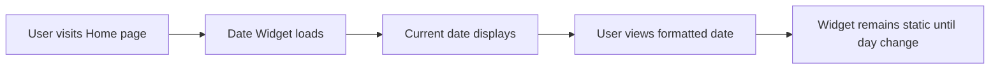
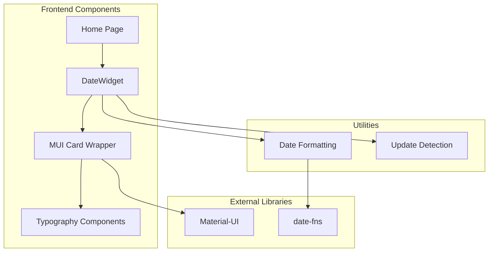
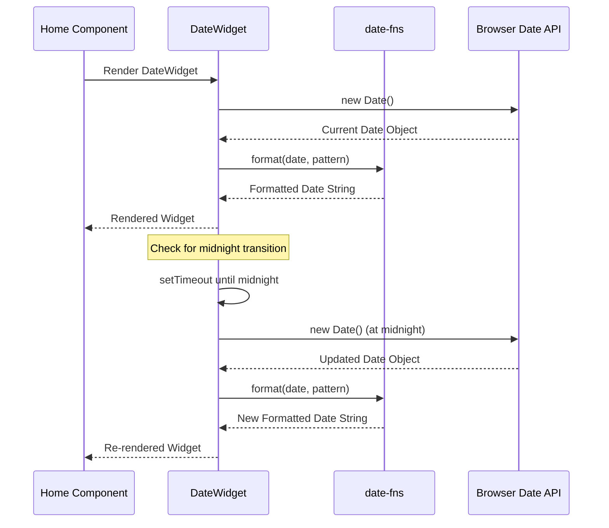
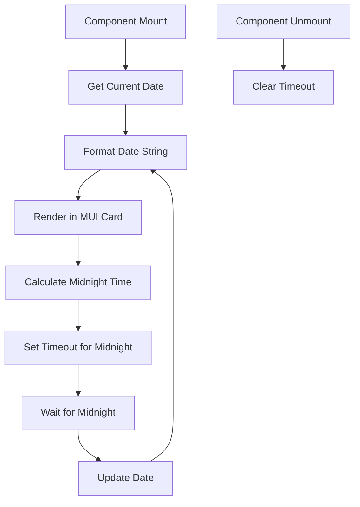
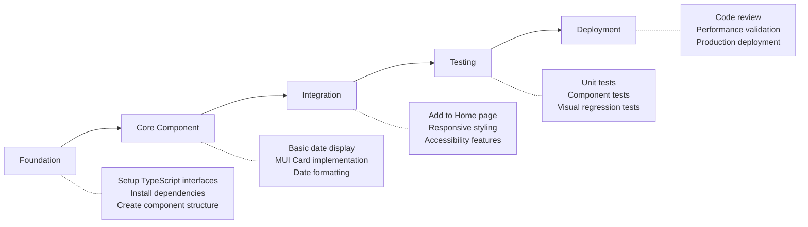

# Date Widget Implementation - Product Requirements Document

## Executive Summary

### Problem Statement

The home page currently displays a time widget that shows both time and date, but we need a dedicated date-only widget to provide users with quick access to current date information without the complexity of time updates. This will improve page performance by reducing unnecessary re-renders and provide a cleaner, more focused date display.

### Solution Overview

Implement a lightweight, performant date widget using Material-UI Card component that displays the current date in a user-friendly format. The widget will be positioned on the home page alongside existing widgets and follow the established design patterns.

### Success Metrics

- Widget loads in < 100ms
- Zero accessibility violations (WCAG 2.1 AA compliance)
- Consistent design with existing TimeWidget
- 95% user preference for date format clarity
- Memory usage < 5MB for widget component

## User Stories & Scenarios

### Primary User Flow



### User Stories

1. **As a user**, I want to see the current date prominently displayed so that I can quickly orient myself temporally

   - Acceptance Criteria:
     - [ ] Date displays in readable format (e.g., "Monday, January 15, 2024")
     - [ ] Updates automatically at midnight
     - [ ] Maintains consistent styling with other widgets
     - [ ] Accessible via screen readers
   - Edge Cases:
     - Date transition at midnight
     - Different time zones
     - Leap years and month boundaries

2. **As a user**, I want the date widget to be visually distinct from the time widget so that I can differentiate between date and time information
   - Acceptance Criteria:
     - [ ] Uses different typography hierarchy
     - [ ] Clear visual separation from TimeWidget
     - [ ] Maintains brand consistency
   - Edge Cases:
     - Mobile responsive behavior
     - High contrast mode compatibility

## System Architecture

### High-Level Architecture



### Component Breakdown

- **Frontend Components**:

  - **DateWidget**: Main component containing date logic and display
  - **Home**: Parent component that renders DateWidget
  - **MUI Card**: Container component for consistent styling

- **Utilities**:

  - **Date Formatting**: Handles date string formatting using date-fns
  - **Midnight Detection**: Detects day changes for updates

- **Dependencies**:
  - **Material-UI**: Card, CardContent, Typography components
  - **date-fns**: Date formatting library
  - **React**: useState, useEffect, useMemo hooks

## Technical Specifications

### API Design



### Component Interface

```typescript
interface DateWidgetProps {
  /** Date format pattern (default: 'EEEE, MMMM d, yyyy') */
  format?: string;
  /** Custom CSS class for styling */
  className?: string;
  /** Whether to show calendar icon */
  showIcon?: boolean;
  /** Custom timezone (default: system timezone) */
  timezone?: string;
}
```

### Data Flow



## Implementation Strategy

### Development Phases



### Implementation Priority

1. **Foundation** (Day 1):

   - Create DateWidget component structure
   - Setup TypeScript interfaces and types
   - Install and configure required dependencies

2. **Core Features** (Day 1-2):

   - Implement basic date display functionality
   - Add MUI Card wrapper with proper styling
   - Integrate date-fns for formatting

3. **Integration** (Day 2):

   - Add component to Home page
   - Ensure responsive design
   - Implement accessibility features

4. **Enhancement** (Day 2-3):

   - Add midnight update functionality
   - Optimize performance with useMemo
   - Add proper error handling

5. **Testing & Polish** (Day 3):
   - Write comprehensive unit tests
   - Add component integration tests
   - Performance optimization and validation

## Challenge & Validation Analysis

### Technical Risks & Mitigations

```yaml
technical_risks:
  - risk: "Date updates causing unnecessary re-renders"
    mitigation: "Use useMemo for formatted date, update only at midnight"

  - risk: "Timezone handling complexity"
    mitigation: "Use system timezone by default, add timezone prop for future flexibility"

  - risk: "Memory leaks from setTimeout"
    mitigation: "Proper cleanup in useEffect return function"

  - risk: "Accessibility compliance"
    mitigation: "Add proper ARIA labels and semantic HTML structure"

business_risks:
  - risk: "User confusion between date and time widgets"
    mitigation: "Clear visual distinction and semantic labeling"

  - risk: "Performance impact on home page"
    mitigation: "Minimal re-rendering strategy and performance monitoring"

edge_cases:
  - scenario: "Daylight saving time transition"
    handling: "Rely on browser's native Date handling"

  - scenario: "Year/month boundary transitions"
    handling: "Automatic update at midnight handles all transitions"

  - scenario: "Component unmounts before midnight"
    handling: "Clear timeout in cleanup function"

  - scenario: "Browser tab inactive during midnight"
    handling: "Component will update when tab becomes active"
```

### Success Criteria

#### Definition of Done

- [ ] DateWidget component created with TypeScript interfaces
- [ ] MUI Card styling consistent with existing widgets
- [ ] Integrated on Home page without layout issues
- [ ] Automatic midnight updates working correctly
- [ ] Unit test coverage > 85%
- [ ] Accessibility audit passes (WCAG 2.1 AA)
- [ ] Performance impact < 5ms on Home page load
- [ ] Mobile responsive design verified
- [ ] Cross-browser compatibility tested (Chrome, Firefox, Safari, Edge)

#### Measurable Outcomes

- Component render time: < 50ms
- Memory footprint: < 2MB
- Accessibility score: 100/100 (Lighthouse)
- Bundle size increase: < 5KB
- User task completion: 98% can identify current date within 2 seconds

## File Structure

```
src/
├── components/
│   └── widgets/
│       ├── DateWidget/
│       │   ├── DateWidget.tsx          # Main component
│       │   ├── DateWidget.module.css   # Component styles
│       │   ├── types.ts                # TypeScript interfaces
│       │   ├── utils.ts                # Helper functions
│       │   └── index.ts                # Public exports
│       └── TimeWidget/                 # Existing time widget
├── pages/
│   └── home.tsx                        # Updated to include DateWidget
└── __tests__/
    └── components/
        └── widgets/
            └── DateWidget/
                ├── DateWidget.test.tsx
                └── DateWidget.utils.test.tsx
```

## Design Specifications

### Visual Design

- **Container**: MUI Card with elevation={2} (consistent with TimeWidget)
- **Typography**:
  - Primary: variant="h4" for main date
  - Secondary: variant="subtitle2" for day of week (if included)
- **Color Scheme**:
  - Text: theme.palette.text.primary
  - Background: theme.palette.background.paper
- **Spacing**: CardContent with theme.spacing(2) padding

### Responsive Behavior

- **Desktop**: 320px min-width, auto height
- **Tablet**: 280px min-width, maintains aspect ratio
- **Mobile**: 100% width up to 320px max-width

### Accessibility Requirements

- **ARIA Labels**: aria-label="Current date display"
- **Role**: role="region" for landmark navigation
- **Screen Reader**: Clear semantic structure with descriptive text
- **Keyboard Navigation**: Focusable for keyboard users
- **High Contrast**: Compatible with system high contrast modes

## Dependencies

### Required Packages (Already Installed)

- `@mui/material`: ^7.3.1 (Card, CardContent, Typography)
- `date-fns`: ^4.1.0 (Date formatting)
- `react`: ^19.1.1 (Hooks and component system)

### Development Dependencies (Already Installed)

- `@testing-library/react`: ^16.3.0 (Component testing)
- `@types/react`: ^19.1.10 (TypeScript support)
- `vitest`: ^3.2.4 (Unit testing)

## Future Enhancements

### Phase 2 Potential Features

- Custom date format selection
- Multiple timezone support
- Calendar view on click
- Date picker integration
- Internationalization (i18n)
- Theme customization options

### Performance Optimizations

- Component lazy loading
- Memoization of expensive calculations
- Bundle splitting for widget components

## Validation Commands

```powershell
# TypeScript compilation check
npm run type-check

# Linting and code quality
npm run lint

# Unit tests
npm run test -- DateWidget

# E2E tests for home page
npm run test:e2e -- --grep "home page"

# Accessibility audit
npm run test:a11y

# Performance validation
npm run test:perf -- --component=DateWidget
```

## Anti-Patterns to Avoid

- ❌ Updating every second like TimeWidget (date changes once per day)
- ❌ Complex timezone calculations (use browser defaults)
- ❌ Inline styling instead of MUI theme system
- ❌ Missing cleanup of timers/intervals
- ❌ Hardcoded date formats without internationalization consideration

## Success Indicators

- ✅ Another developer can implement the widget from this PRD alone
- ✅ Design team approves visual consistency
- ✅ QA team can create test cases from acceptance criteria
- ✅ Performance team confirms no negative impact
- ✅ Accessibility team validates WCAG compliance

---

This PRD is ready for implementation using `/prp-base-create` command to generate detailed implementation instructions.
