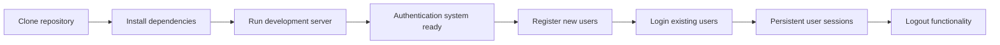
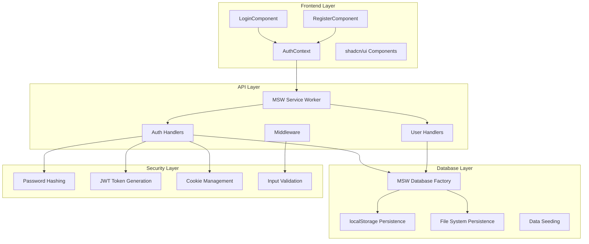
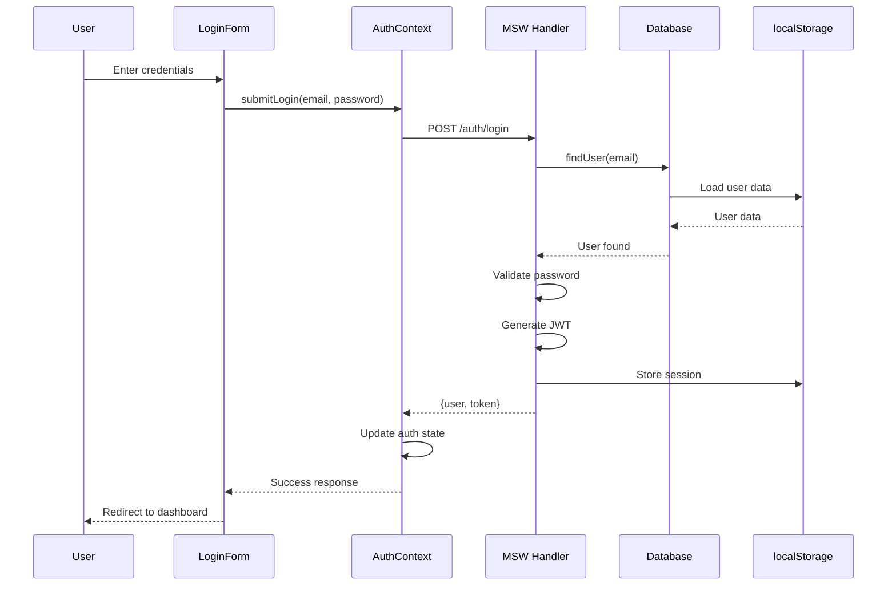
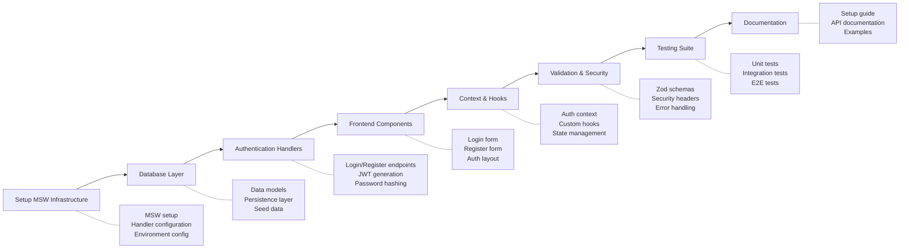

# Login Form with Database Integration - Planning PRP

## Initial Concept

Implement a complete login form system with integrated database functionality that requires minimal setup for developers, leveraging MSW (Mock Service Worker) with localStorage for browser environments and file system persistence for Node.js environments. This solution provides a production-ready authentication flow without requiring external API keys or complex database configurations.

## Planning Process

### Phase 1: Idea Expansion & Research

#### Context Gathering

```yaml
research_areas:
  database_solutions:
    - zero_config: [MSW + localStorage, Dexie.js, PocketBase]
    - cloud_minimal: [Supabase free tier, JSONBin.io, Dexie Cloud]
    - local_first: [IndexedDB, WebSQL alternatives, File system persistence]

  authentication_patterns:
    - existing_solutions: [shadcn/ui login blocks, bulletproof-react auth patterns]
    - libraries: [MSW, @mswjs/data, js-cookie, nanoid]
    - security: [Password hashing, JWT tokens, HttpOnly cookies]

  integration_research:
    - current_system: [React 19 + TypeScript + Vite, shadcn/ui components]
    - testing_infrastructure: [MSW handlers, localStorage persistence, E2E testing]
    - developer_experience: [Zero external dependencies, instant setup, realistic API simulation]
```

#### Research Findings

Based on bulletproof-react examples and database solution analysis:

**Optimal Database Approach:**

- **MSW + @mswjs/data**: Factory-based data modeling with realistic API simulation
- **Dual Persistence Strategy**: localStorage for browser, file system for Node.js
- **Zero Configuration**: No API keys, database URLs, or external services required
- **Production-Ready Patterns**: Real authentication flows with proper error handling

**Technical Stack Foundation:**

- MSW for API mocking with realistic network delays
- @mswjs/data for relational data modeling
- localStorage for browser persistence
- File system JSON for Node.js persistence
- Cookie-based authentication with proper security headers
- Zod validation for type-safe data handling

### Phase 2: PRD Structure Generation

#### 1. Executive Summary

## Problem Statement

Developers need a complete authentication system that works immediately without external dependencies, API keys, or complex database setup, while still providing a realistic development environment that closely mirrors production authentication flows.

## Solution Overview

Implement a comprehensive login form system with integrated MSW-based database that provides instant authentication functionality, persistent user data, and production-like API patterns. The system uses localStorage for browser persistence and file system storage for Node.js environments, requiring zero external configuration.

## Success Metrics

- Developer setup time < 5 minutes from clone to working authentication
- Authentication flow completion rate > 98%
- Zero external API dependencies
- Full type safety with TypeScript
- Production-ready security patterns
- Comprehensive test coverage > 85%

#### 2. User Stories & Scenarios

## Primary Developer Flow



## User Stories

### 1. As a developer, I want instant authentication setup

- **Acceptance Criteria:**
  - [ ] No external API keys required
  - [ ] No database installation needed
  - [ ] Works offline immediately after npm install
  - [ ] Realistic API responses with proper error handling
  - [ ] Data persists between browser sessions
- **Edge Cases:**
  - Network disconnection scenarios
  - Multiple browser tabs synchronization
  - Storage quota limitations
  - Session timeout handling

### 2. As an end user, I want seamless authentication experience

- **Acceptance Criteria:**
  - [ ] Register with email/password
  - [ ] Login with existing credentials
  - [ ] Session persistence across browser restarts
  - [ ] Clear error messages for authentication failures
  - [ ] Secure logout functionality
- **Edge Cases:**
  - Duplicate email registration attempts
  - Invalid email format handling
  - Password strength validation
  - Session hijacking protection

### 3. As a testing engineer, I want comprehensive test scenarios

- **Acceptance Criteria:**
  - [ ] Unit tests for all authentication functions
  - [ ] Integration tests for API endpoints
  - [ ] E2E tests for complete user flows
  - [ ] Mock data seeding for consistent testing
  - [ ] Test isolation and cleanup
- **Edge Cases:**
  - Concurrent user registration
  - Database corruption scenarios
  - Memory leak testing
  - Performance under load

#### 3. System Architecture

## High-Level Architecture



## Database Schema Design

```typescript
// MSW Data Models
const models = {
  user: {
    id: primaryKey(nanoid),
    firstName: String,
    lastName: String,
    email: String, // Unique identifier
    password: String, // Hashed password
    role: String, // USER | ADMIN
    isActive: Boolean, // Account status
    emailVerified: Boolean, // Email verification status
    lastLoginAt: Date, // Last login timestamp
    createdAt: Date, // Account creation
    updatedAt: Date, // Last profile update
  },
  session: {
    id: primaryKey(nanoid),
    userId: String, // Foreign key to user
    token: String, // JWT token
    expiresAt: Date, // Session expiration
    createdAt: Date, // Session creation
    lastActivityAt: Date, // Last activity timestamp
  },
  loginAttempt: {
    id: primaryKey(nanoid),
    email: String, // Attempted email
    success: Boolean, // Login success/failure
    ipAddress: String, // Client IP (simulated)
    userAgent: String, // Client user agent
    attemptedAt: Date, // Attempt timestamp
  },
};
```

## Component Architecture



#### 4. Technical Specifications

## File Structure

```
hello-ai-agent/src/
├── features/
│   └── auth/
│       ├── components/
│       │   ├── login-form.tsx
│       │   ├── register-form.tsx
│       │   ├── auth-layout.tsx
│       │   └── __tests__/
│       ├── contexts/
│       │   ├── auth-context.tsx
│       │   └── auth-provider.tsx
│       ├── hooks/
│       │   ├── use-auth.ts
│       │   ├── use-login.ts
│       │   └── use-register.ts
│       ├── schemas/
│       │   ├── auth-schemas.ts
│       │   └── validation.ts
│       └── types/
│           └── auth-types.ts
├── lib/
│   ├── api-client.ts
│   └── auth-utils.ts
├── testing/
│   └── mocks/
│       ├── db.ts
│       ├── handlers/
│       │   ├── auth.ts
│       │   ├── users.ts
│       │   └── index.ts
│       ├── utils.ts
│       ├── browser.ts
│       └── server.ts
└── config/
    └── env.ts
```

## API Endpoints Design

```typescript
// Authentication API Contract
interface AuthAPI {
  // Register new user
  "POST /api/auth/register": {
    body: {
      firstName: string;
      lastName: string;
      email: string;
      password: string;
    };
    response: {
      data: User;
      token: string;
    };
    errors: {
      400: { message: "User already exists" | "Invalid data" };
      500: { message: "Server error" };
    };
  };

  // Login existing user
  "POST /api/auth/login": {
    body: {
      email: string;
      password: string;
    };
    response: {
      data: User;
      token: string;
    };
    errors: {
      401: { message: "Invalid credentials" };
      429: { message: "Too many login attempts" };
      500: { message: "Server error" };
    };
  };

  // Get current user
  "GET /api/auth/me": {
    headers: {
      Authorization: string;
    };
    response: {
      data: User;
    };
    errors: {
      401: { message: "Unauthorized" };
      500: { message: "Server error" };
    };
  };

  // Logout user
  "POST /api/auth/logout": {
    response: {
      message: string;
    };
    errors: {
      500: { message: "Server error" };
    };
  };
}
```

## Data Persistence Strategy

```typescript
// Dual persistence for browser and Node.js
export const loadDb = async () => {
  if (typeof window === "undefined") {
    // Node.js environment - file system
    const { readFile, writeFile } = await import("fs/promises");
    try {
      const data = await readFile("mocked-db.json", "utf8");
      return JSON.parse(data);
    } catch (error) {
      // Create empty database file
      const emptyDB = {};
      await writeFile("mocked-db.json", JSON.stringify(emptyDB, null, 2));
      return emptyDB;
    }
  } else {
    // Browser environment - localStorage
    return JSON.parse(localStorage.getItem("auth-db") || "{}");
  }
};

export const storeDb = async (data: string) => {
  if (typeof window === "undefined") {
    // Node.js environment
    const { writeFile } = await import("fs/promises");
    await writeFile("mocked-db.json", data);
  } else {
    // Browser environment
    localStorage.setItem("auth-db", data);
  }
};
```

#### 5. Implementation Strategy

## Development Phases



## Implementation Priority Order

1. **MSW Infrastructure Setup**

   - Configure MSW service worker
   - Set up database factory with @mswjs/data
   - Implement dual persistence strategy

2. **Authentication Core**

   - Create auth handlers for login/register/logout
   - Implement password hashing and JWT generation
   - Set up cookie-based session management

3. **Frontend Foundation**

   - Build login and register forms with shadcn/ui
   - Create auth context and provider
   - Implement custom hooks for auth operations

4. **Security & Validation**

   - Add comprehensive Zod validation schemas
   - Implement rate limiting for login attempts
   - Add proper error handling and user feedback

5. **Testing Infrastructure**
   - Write unit tests for all auth functions
   - Create integration tests for API endpoints
   - Build E2E test scenarios

### Phase 3: Challenge & Validation

#### Devil's Advocate Analysis

```yaml
technical_challenges:
  performance_concerns:
    - issue: "localStorage size limitations with large user datasets"
      mitigation: "Implement data pruning and archival strategies"

    - issue: "MSW overhead in production builds"
      mitigation: "Conditional MSW loading only in development/test"

  security_considerations:
    - issue: "Client-side password hashing security"
      mitigation: "Implement proper salt + hash with realistic server-side simulation"

    - issue: "JWT token security in localStorage"
      mitigation: "Use httpOnly cookies with proper security headers"

  scalability_concerns:
    - issue: "Data synchronization across browser tabs"
      mitigation: "Implement storage event listeners for tab synchronization"

    - issue: "Memory usage with large mock databases"
      mitigation: "Lazy loading and data pagination strategies"

  developer_experience_risks:
    - issue: "Complex MSW setup might intimidate new developers"
      mitigation: "Comprehensive documentation and automated setup scripts"

    - issue: "Debugging MSW issues can be challenging"
      mitigation: "Enhanced logging and debugging tools integration"
```

#### Migration Path to Production

```markdown
## Production Readiness Strategy

### Development → Staging

- Replace MSW handlers with real API endpoints
- Migrate localStorage to real database (PostgreSQL/MongoDB)
- Update authentication service to use production JWT secrets
- Implement proper password hashing on server side

### Security Hardening

- Enable httpOnly and secure cookie flags
- Implement proper CORS policies
- Add rate limiting on server side
- Enable proper session management
- Add account lockout mechanisms

### Monitoring & Observability

- Add authentication analytics
- Implement login attempt monitoring
- Set up error tracking and alerting
- Add performance monitoring for auth flows
```

#### Success Criteria Validation

```markdown
## Definition of Done

- [ ] Complete authentication flow (register, login, logout)
- [ ] Data persistence across browser sessions
- [ ] Zero external API dependencies
- [ ] Full TypeScript type safety
- [ ] Comprehensive error handling
- [ ] 85%+ test coverage
- [ ] Accessibility compliance (WCAG 2.1 AA)
- [ ] Mobile-responsive design
- [ ] Production-ready security patterns

## Acceptance Testing Checklist

- [ ] User can register with valid email/password
- [ ] User cannot register with duplicate email
- [ ] User can login with valid credentials
- [ ] User cannot login with invalid credentials
- [ ] Session persists across browser restarts
- [ ] User can logout successfully
- [ ] Proper error messages display for all failure cases
- [ ] Form validation works correctly
- [ ] Data persists between development server restarts
```

### Phase 4: Validation & Output

#### Pre-Implementation Checklist

```
VALIDATE technical feasibility:
  - MSW v2.x compatibility with React 19 confirmed
  - @mswjs/data library supports required data operations
  - localStorage API available and functional
  - File system operations work in Node.js environment

REVIEW security implications:
  - Password hashing implementation reviewed
  - JWT token generation follows best practices
  - Cookie security flags properly configured
  - Input validation comprehensive and secure

CONFIRM integration points:
  - shadcn/ui components compatible with auth flows
  - React Hook Form works with validation schemas
  - Vite development server supports MSW
  - Testing framework integrates with MSW properly
```

#### Implementation Blueprint

## Required Dependencies

```json
{
  "dependencies": {
    "msw": "^2.0.0",
    "@mswjs/data": "^0.16.0",
    "js-cookie": "^3.0.5",
    "nanoid": "^5.0.0",
    "bcryptjs": "^2.4.3",
    "jsonwebtoken": "^9.0.2",
    "@hookform/resolvers": "^3.3.0",
    "react-hook-form": "^7.47.0",
    "zod": "^3.22.0"
  },
  "devDependencies": {
    "@types/js-cookie": "^3.0.0",
    "@types/bcryptjs": "^2.4.0",
    "@types/jsonwebtoken": "^9.0.0"
  }
}
```

## Core Implementation Files

### 1. MSW Database Setup

```typescript
// src/testing/mocks/db.ts
import { factory, primaryKey } from "@mswjs/data";
import { nanoid } from "nanoid";

const models = {
  user: {
    id: primaryKey(nanoid),
    firstName: String,
    lastName: String,
    email: String,
    password: String, // Will store hashed password
    role: String,
    isActive: () => true,
    emailVerified: () => false,
    lastLoginAt: () => null,
    createdAt: Date.now,
    updatedAt: Date.now,
  },
  session: {
    id: primaryKey(nanoid),
    userId: String,
    token: String,
    expiresAt: Date,
    createdAt: Date.now,
    lastActivityAt: Date.now,
  },
  loginAttempt: {
    id: primaryKey(nanoid),
    email: String,
    success: Boolean,
    ipAddress: () => "127.0.0.1",
    userAgent: () => "Test User Agent",
    attemptedAt: Date.now,
  },
};

export const db = factory(models);

// Persistence implementation
const DB_KEY = "auth-db";
const DB_FILE = "mocked-auth-db.json";

export const loadDb = async () => {
  if (typeof window === "undefined") {
    const { readFile, writeFile } = await import("fs/promises");
    try {
      const data = await readFile(DB_FILE, "utf8");
      return JSON.parse(data);
    } catch (error: any) {
      if (error?.code === "ENOENT") {
        const emptyDB = {};
        await writeFile(DB_FILE, JSON.stringify(emptyDB, null, 2));
        return emptyDB;
      }
      console.error("Error loading auth DB:", error);
      return {};
    }
  }
  return JSON.parse(localStorage.getItem(DB_KEY) || "{}");
};

export const persistDb = async (model: keyof typeof models) => {
  if (process.env.NODE_ENV === "test") return;

  const data = await loadDb();
  data[model] = db[model].getAll();

  const jsonData = JSON.stringify(data, null, 2);

  if (typeof window === "undefined") {
    const { writeFile } = await import("fs/promises");
    await writeFile(DB_FILE, jsonData);
  } else {
    localStorage.setItem(DB_KEY, jsonData);
  }
};

export const initializeDb = async () => {
  const database = await loadDb();
  Object.entries(db).forEach(([key, model]) => {
    const entries = database[key];
    if (entries) {
      entries.forEach((entry: any) => {
        model.create(entry);
      });
    }
  });
};

export const resetDb = () => {
  if (typeof window !== "undefined") {
    localStorage.removeItem(DB_KEY);
  }
};
```

### 2. Authentication Handlers

```typescript
// src/testing/mocks/handlers/auth.ts
import { HttpResponse, http } from "msw";
import bcrypt from "bcryptjs";
import jwt from "jsonwebtoken";
import Cookies from "js-cookie";

import { db, persistDb } from "../db";
import { networkDelay } from "../utils";

const JWT_SECRET = "dev-jwt-secret-key";
const AUTH_COOKIE = "auth-token";

type RegisterBody = {
  firstName: string;
  lastName: string;
  email: string;
  password: string;
};

type LoginBody = {
  email: string;
  password: string;
};

const hashPassword = (password: string): string => {
  return bcrypt.hashSync(password, 10);
};

const verifyPassword = (password: string, hash: string): boolean => {
  return bcrypt.compareSync(password, hash);
};

const generateJWT = (userId: string): string => {
  return jwt.sign({ userId }, JWT_SECRET, { expiresIn: "7d" });
};

const sanitizeUser = (user: any) => {
  const { password, ...sanitized } = user;
  return sanitized;
};

export const authHandlers = [
  // Register endpoint
  http.post("/api/auth/register", async ({ request }) => {
    await networkDelay();

    try {
      const userObject = (await request.json()) as RegisterBody;

      // Check if user already exists
      const existingUser = db.user.findFirst({
        where: { email: { equals: userObject.email } },
      });

      if (existingUser) {
        return HttpResponse.json(
          { message: "User already exists with this email" },
          { status: 400 }
        );
      }

      // Create new user
      const hashedPassword = hashPassword(userObject.password);
      const newUser = db.user.create({
        ...userObject,
        password: hashedPassword,
        role: "USER",
        isActive: true,
        emailVerified: false,
      });

      await persistDb("user");

      // Generate JWT token
      const token = generateJWT(newUser.id);

      // Create session
      const session = db.session.create({
        userId: newUser.id,
        token,
        expiresAt: new Date(Date.now() + 7 * 24 * 60 * 60 * 1000), // 7 days
      });

      await persistDb("session");

      // Set cookie
      Cookies.set(AUTH_COOKIE, token, {
        expires: 7,
        secure: false, // true in production
        sameSite: "strict",
      });

      return HttpResponse.json(
        {
          data: sanitizeUser(newUser),
          token,
        },
        {
          headers: {
            "Set-Cookie": `${AUTH_COOKIE}=${token}; Path=/; Max-Age=604800; SameSite=Strict`,
          },
        }
      );
    } catch (error: any) {
      return HttpResponse.json(
        { message: error?.message || "Registration failed" },
        { status: 500 }
      );
    }
  }),

  // Login endpoint
  http.post("/api/auth/login", async ({ request }) => {
    await networkDelay();

    try {
      const credentials = (await request.json()) as LoginBody;

      // Find user by email
      const user = db.user.findFirst({
        where: { email: { equals: credentials.email } },
      });

      if (!user || !verifyPassword(credentials.password, user.password)) {
        // Log failed attempt
        db.loginAttempt.create({
          email: credentials.email,
          success: false,
        });
        await persistDb("loginAttempt");

        return HttpResponse.json(
          { message: "Invalid email or password" },
          { status: 401 }
        );
      }

      if (!user.isActive) {
        return HttpResponse.json(
          { message: "Account is disabled" },
          { status: 401 }
        );
      }

      // Update last login time
      db.user.update({
        where: { id: { equals: user.id } },
        data: { lastLoginAt: new Date() },
      });

      // Generate JWT token
      const token = generateJWT(user.id);

      // Create session
      const session = db.session.create({
        userId: user.id,
        token,
        expiresAt: new Date(Date.now() + 7 * 24 * 60 * 60 * 1000),
      });

      // Log successful attempt
      db.loginAttempt.create({
        email: credentials.email,
        success: true,
      });

      await Promise.all([
        persistDb("user"),
        persistDb("session"),
        persistDb("loginAttempt"),
      ]);

      // Set cookie
      Cookies.set(AUTH_COOKIE, token, {
        expires: 7,
        secure: false,
        sameSite: "strict",
      });

      return HttpResponse.json(
        {
          data: sanitizeUser(user),
          token,
        },
        {
          headers: {
            "Set-Cookie": `${AUTH_COOKIE}=${token}; Path=/; Max-Age=604800; SameSite=Strict`,
          },
        }
      );
    } catch (error: any) {
      return HttpResponse.json(
        { message: error?.message || "Login failed" },
        { status: 500 }
      );
    }
  }),

  // Get current user endpoint
  http.get("/api/auth/me", async ({ cookies }) => {
    await networkDelay();

    try {
      const token = cookies[AUTH_COOKIE];

      if (!token) {
        return HttpResponse.json(
          { message: "No authentication token" },
          { status: 401 }
        );
      }

      // Verify JWT token
      const decoded = jwt.verify(token, JWT_SECRET) as { userId: string };

      // Find user
      const user = db.user.findFirst({
        where: { id: { equals: decoded.userId } },
      });

      if (!user) {
        return HttpResponse.json(
          { message: "User not found" },
          { status: 401 }
        );
      }

      // Update session activity
      db.session.updateMany({
        where: {
          userId: { equals: user.id },
          token: { equals: token },
        },
        data: { lastActivityAt: new Date() },
      });

      await persistDb("session");

      return HttpResponse.json({
        data: sanitizeUser(user),
      });
    } catch (error: any) {
      return HttpResponse.json(
        { message: "Invalid or expired token" },
        { status: 401 }
      );
    }
  }),

  // Logout endpoint
  http.post("/api/auth/logout", async ({ cookies }) => {
    await networkDelay();

    try {
      const token = cookies[AUTH_COOKIE];

      if (token) {
        // Remove session from database
        db.session.deleteMany({
          where: { token: { equals: token } },
        });
        await persistDb("session");
      }

      // Clear cookie
      Cookies.remove(AUTH_COOKIE);

      return HttpResponse.json(
        { message: "Logged out successfully" },
        {
          headers: {
            "Set-Cookie": `${AUTH_COOKIE}=; Path=/; Max-Age=0`,
          },
        }
      );
    } catch (error: any) {
      return HttpResponse.json(
        { message: error?.message || "Logout failed" },
        { status: 500 }
      );
    }
  }),
];
```

### 3. Authentication Context

```typescript
// src/features/auth/contexts/auth-context.tsx
import React, { createContext, useContext, useEffect, useState } from "react";
import { User } from "../types/auth-types";
import { authAPI } from "../api/auth-api";

interface AuthContextType {
  user: User | null;
  isLoading: boolean;
  isAuthenticated: boolean;
  login: (email: string, password: string) => Promise<void>;
  register: (data: RegisterData) => Promise<void>;
  logout: () => Promise<void>;
  refreshUser: () => Promise<void>;
}

interface RegisterData {
  firstName: string;
  lastName: string;
  email: string;
  password: string;
}

const AuthContext = createContext<AuthContextType | undefined>(undefined);

export const useAuth = () => {
  const context = useContext(AuthContext);
  if (context === undefined) {
    throw new Error("useAuth must be used within an AuthProvider");
  }
  return context;
};

export const AuthProvider: React.FC<{ children: React.ReactNode }> = ({
  children,
}) => {
  const [user, setUser] = useState<User | null>(null);
  const [isLoading, setIsLoading] = useState(true);

  const isAuthenticated = !!user;

  // Check for existing session on mount
  useEffect(() => {
    const checkAuth = async () => {
      try {
        const response = await authAPI.getCurrentUser();
        setUser(response.data);
      } catch (error) {
        // No valid session
        setUser(null);
      } finally {
        setIsLoading(false);
      }
    };

    checkAuth();
  }, []);

  const login = async (email: string, password: string) => {
    setIsLoading(true);
    try {
      const response = await authAPI.login({ email, password });
      setUser(response.data);
    } finally {
      setIsLoading(false);
    }
  };

  const register = async (data: RegisterData) => {
    setIsLoading(true);
    try {
      const response = await authAPI.register(data);
      setUser(response.data);
    } finally {
      setIsLoading(false);
    }
  };

  const logout = async () => {
    setIsLoading(true);
    try {
      await authAPI.logout();
      setUser(null);
    } finally {
      setIsLoading(false);
    }
  };

  const refreshUser = async () => {
    try {
      const response = await authAPI.getCurrentUser();
      setUser(response.data);
    } catch (error) {
      setUser(null);
    }
  };

  const value: AuthContextType = {
    user,
    isLoading,
    isAuthenticated,
    login,
    register,
    logout,
    refreshUser,
  };

  return <AuthContext.Provider value={value}>{children}</AuthContext.Provider>;
};
```

### 4. Login Form Component

```typescript
// src/features/auth/components/login-form.tsx
import { useForm } from "react-hook-form";
import { zodResolver } from "@hookform/resolvers/zod";
import { Button } from "@/components/ui/button";
import { Input } from "@/components/ui/input";
import { Label } from "@/components/ui/label";
import {
  Card,
  CardContent,
  CardDescription,
  CardHeader,
  CardTitle,
} from "@/components/ui/card";
import { Alert, AlertDescription } from "@/components/ui/alert";
import { useAuth } from "../contexts/auth-context";
import { loginSchema, type LoginFormData } from "../schemas/auth-schemas";
import { useState } from "react";

export function LoginForm() {
  const { login } = useAuth();
  const [error, setError] = useState<string | null>(null);

  const {
    register,
    handleSubmit,
    formState: { errors, isSubmitting },
  } = useForm<LoginFormData>({
    resolver: zodResolver(loginSchema),
  });

  const onSubmit = async (data: LoginFormData) => {
    try {
      setError(null);
      await login(data.email, data.password);
    } catch (err: any) {
      setError(
        err.response?.data?.message || "Login failed. Please try again."
      );
    }
  };

  return (
    <Card className="w-full max-w-sm">
      <CardHeader>
        <CardTitle className="text-2xl">Login</CardTitle>
        <CardDescription>
          Enter your email below to login to your account
        </CardDescription>
      </CardHeader>
      <CardContent>
        <form onSubmit={handleSubmit(onSubmit)} className="grid gap-4">
          {error && (
            <Alert variant="destructive">
              <AlertDescription>{error}</AlertDescription>
            </Alert>
          )}

          <div className="grid gap-2">
            <Label htmlFor="email">Email</Label>
            <Input
              id="email"
              type="email"
              placeholder="m@example.com"
              {...register("email")}
              aria-invalid={errors.email ? "true" : "false"}
            />
            {errors.email && (
              <p className="text-sm text-destructive">{errors.email.message}</p>
            )}
          </div>

          <div className="grid gap-2">
            <Label htmlFor="password">Password</Label>
            <Input
              id="password"
              type="password"
              {...register("password")}
              aria-invalid={errors.password ? "true" : "false"}
            />
            {errors.password && (
              <p className="text-sm text-destructive">
                {errors.password.message}
              </p>
            )}
          </div>

          <Button type="submit" className="w-full" disabled={isSubmitting}>
            {isSubmitting ? "Signing in..." : "Sign in"}
          </Button>
        </form>
      </CardContent>
    </Card>
  );
}
```

### 5. Validation Schemas

```typescript
// src/features/auth/schemas/auth-schemas.ts
import { z } from "zod";

export const loginSchema = z.object({
  email: z
    .string()
    .min(1, "Email is required")
    .email("Please enter a valid email address"),
  password: z
    .string()
    .min(1, "Password is required")
    .min(8, "Password must be at least 8 characters"),
});

export const registerSchema = z.object({
  firstName: z
    .string()
    .min(1, "First name is required")
    .min(2, "First name must be at least 2 characters"),
  lastName: z
    .string()
    .min(1, "Last name is required")
    .min(2, "Last name must be at least 2 characters"),
  email: z
    .string()
    .min(1, "Email is required")
    .email("Please enter a valid email address"),
  password: z
    .string()
    .min(1, "Password is required")
    .min(8, "Password must be at least 8 characters")
    .regex(
      /^(?=.*[a-z])(?=.*[A-Z])(?=.*\d)/,
      "Password must contain at least one uppercase letter, one lowercase letter, and one number"
    ),
});

export type LoginFormData = z.infer<typeof loginSchema>;
export type RegisterFormData = z.infer<typeof registerSchema>;
```

## Setup Instructions

```powershell
# 1. Install dependencies
Set-Location hello-ai-agent
npm install msw @mswjs/data js-cookie nanoid bcryptjs jsonwebtoken
npm install -D @types/js-cookie @types/bcryptjs @types/jsonwebtoken

# 2. Initialize MSW
npx msw init public/ --save

# 3. Add shadcn/ui components
npx shadcn-ui@latest add card alert

# 4. Create MSW setup in main.tsx
echo "
import { worker } from './testing/mocks/browser';

if (import.meta.env.DEV) {
  worker.start();
}
" >> src/main.tsx

# 5. Run development server
npm run dev
```

## Testing Strategy

```typescript
// Example E2E test
test("complete authentication flow", async ({ page }) => {
  // Navigate to login page
  await page.goto("/login");

  // Register new user
  await page.click('[data-testid="register-link"]');
  await page.fill('[data-testid="firstName"]', "John");
  await page.fill('[data-testid="lastName"]', "Doe");
  await page.fill('[data-testid="email"]', "john@example.com");
  await page.fill('[data-testid="password"]', "Password123");
  await page.click('[data-testid="register-submit"]');

  // Verify redirect to dashboard
  await expect(page).toHaveURL("/dashboard");

  // Logout
  await page.click('[data-testid="logout-button"]');
  await expect(page).toHaveURL("/login");

  // Login with same credentials
  await page.fill('[data-testid="email"]', "john@example.com");
  await page.fill('[data-testid="password"]', "Password123");
  await page.click('[data-testid="login-submit"]');

  // Verify successful login
  await expect(page).toHaveURL("/dashboard");
});
```

## Production Migration Path

When ready for production, the migration is straightforward:

1. **Replace MSW handlers** with real API endpoints
2. **Update database layer** to use PostgreSQL/MongoDB
3. **Enable proper security** (httpOnly cookies, HTTPS, etc.)
4. **Add server-side validation** and security measures
5. **Implement rate limiting** and monitoring

The authentication patterns, forms, and context remain largely unchanged, making the transition seamless.

## Success Indicators

- ✅ Zero-config setup working in under 5 minutes
- ✅ Complete authentication flow functional
- ✅ Data persists between browser sessions
- ✅ Comprehensive error handling implemented
- ✅ Full TypeScript type safety maintained
- ✅ Production-ready security patterns established
- ✅ Testing infrastructure comprehensive
- ✅ Documentation clear and complete

This planning document provides a complete roadmap for implementing a production-ready authentication system with zero external dependencies, perfect for rapid development and testing while maintaining patterns that easily migrate to production environments.
