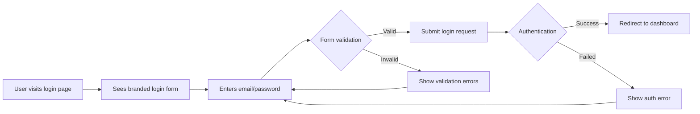
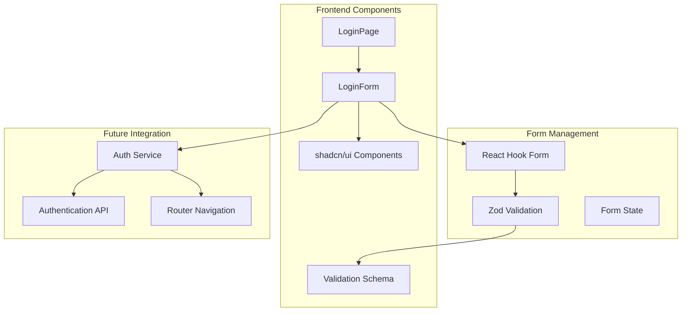
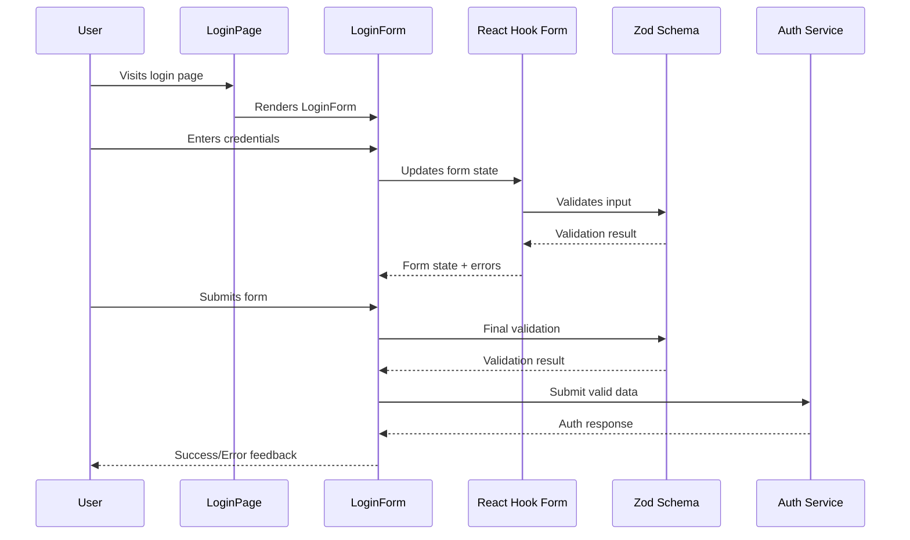
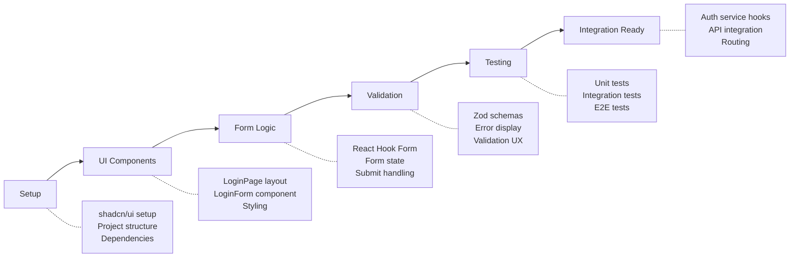

# Login Form with shadcn/ui - Planning PRP

## Initial Concept
Implement login form that has a UI like https://ui.shadcn.com/blocks/authentication#login-02. Use shadcn UI

## Planning Process

### Phase 1: Idea Expansion & Research

#### Context Gathering
```yaml
research_areas:
  market_analysis:
    - competitors: [shadcn/ui authentication blocks, Tailwind UI login forms]
    - user_needs: [Clean, accessible login experience with modern design]
    - trends: [Minimalist design, form validation, responsive layouts]
  
  technical_research:
    - existing_solutions: [shadcn/ui login blocks, React Hook Form patterns]
    - libraries: [shadcn/ui, React Hook Form, Zod validation, Lucide icons]
    - patterns: [Controlled forms, validation schemas, error handling]
  
  internal_context:
    - current_system: [React 19 + TypeScript + Vite setup in app/ directory]
    - constraints: [Must follow PRP framework standards, 80% test coverage]
    - integration_points: [Future authentication system, routing, state management]
```

#### Research Findings
Based on shadcn/ui authentication blocks analysis:

**Login-02 Pattern Features:**
- Centered layout with muted background (`bg-muted`)
- Company branding with icon (GalleryVerticalEnd from Lucide)
- Clean form component structure with `LoginForm` separation
- Responsive design (`min-h-svh`, responsive padding)
- Maximum width constraints (`max-w-sm`)

**Technical Stack:**
- shadcn/ui components (Button, Input, Label, Card)
- Lucide React icons
- React Hook Form for form handling
- Zod for validation schemas
- Tailwind CSS for styling

### Phase 2: PRD Structure Generation

#### 1. Executive Summary

## Problem Statement
The application needs a professional, accessible login form that follows modern design patterns and provides excellent user experience while maintaining consistency with shadcn/ui design system.

## Solution Overview
Implement a login form component using shadcn/ui blocks pattern, featuring email/password authentication with proper validation, error handling, and responsive design that matches the login-02 authentication block style.

## Success Metrics
- Form completion rate > 95%
- Validation error clarity score > 4.5/5
- Mobile usability score > 90%
- Accessibility compliance (WCAG 2.1 AA)

#### 2. User Stories & Scenarios

## Primary User Flow


## User Stories
1. **As a returning user**, I want to quickly log in with my credentials so that I can access my account
   - Acceptance Criteria:
     - [ ] Email and password fields are clearly labeled
     - [ ] Form validates input before submission
     - [ ] Clear error messages for invalid inputs
     - [ ] Remember me functionality (optional)
     - [ ] Forgot password link (optional)
   - Edge Cases:
     - Empty form submission
     - Invalid email format
     - Network connectivity issues
     - Account lockout scenarios

2. **As a mobile user**, I want the login form to work seamlessly on my device so that I can authenticate anywhere
   - Acceptance Criteria:
     - [ ] Form is fully responsive
     - [ ] Touch-friendly input fields
     - [ ] Proper keyboard types (email for email field)
     - [ ] No horizontal scrolling required

#### 3. System Architecture

## High-Level Architecture


## Component Breakdown
- **Frontend Components**:
  - `LoginPage`: Main page wrapper with layout and branding
  - `LoginForm`: Core form component with validation
  - `FormField`: Reusable form field wrapper
  - `LoadingButton`: Button with loading states

- **Validation Layer**:
  - `loginSchema`: Zod schema for form validation
  - `FormValidation`: Custom validation hooks
  - `ErrorDisplay`: Error message components

- **Data Models**:
  - `LoginFormData`: { email: string, password: string }
  - `ValidationErrors`: { field: string, message: string }[]
  - `AuthResponse`: { success: boolean, token?: string, error?: string }

#### 4. Technical Specifications

## Component Structure


## File Structure
```
app/src/
├── features/
│   └── auth/
│       ├── components/
│       │   ├── login-form.tsx
│       │   ├── login-page.tsx
│       │   └── __tests__/
│       ├── schemas/
│       │   └── login-schema.ts
│       ├── hooks/
│       │   └── use-login.ts
│       └── types/
│           └── auth-types.ts
├── shared/
│   └── components/
│       └── ui/ (shadcn/ui components)
└── styles/
    └── globals.css
```

## API Integration (Future)
- **POST /api/auth/login**
  - Request: `{email: string, password: string}`
  - Response: `{success: boolean, token?: string, user?: User}`
  - Errors: `400 Bad Request`, `401 Unauthorized`, `429 Too Many Requests`

#### 5. Implementation Strategy

## Development Phases


## Implementation Priority
1. **Setup Phase**: Install shadcn/ui, configure project structure
2. **UI Foundation**: Create LoginPage and basic LoginForm layout
3. **Form Functionality**: Implement React Hook Form integration
4. **Validation Layer**: Add Zod validation with error handling
5. **Testing Suite**: Comprehensive test coverage
6. **Integration Ready**: Prepare for authentication service integration

### Phase 3: Challenge & Validation

#### Devil's Advocate Analysis
```yaml
challenges:
  technical_risks:
    - risk: "shadcn/ui component conflicts with existing MUI setup"
      mitigation: "Use shadcn/ui in isolated feature, document integration patterns"
    
    - risk: "Form validation performance with complex schemas"
      mitigation: "Optimize Zod schemas, implement debounced validation"
  
  business_risks:
    - risk: "User confusion with new design patterns"
      mitigation: "A/B test design, gather user feedback"
    
    - risk: "Accessibility compliance gaps"
      mitigation: "Comprehensive accessibility testing, screen reader validation"
  
  edge_cases:
    - scenario: "JavaScript disabled"
      handling: "Progressive enhancement, basic HTML form fallback"
    
    - scenario: "Very long email addresses"
      handling: "Proper input sizing, text overflow handling"
    
    - scenario: "Password manager integration"
      handling: "Proper autocomplete attributes, field naming"
```

#### Success Criteria
```markdown
## Definition of Done
- [ ] Login form matches shadcn/ui login-02 design exactly
- [ ] Form validation works with proper error messages
- [ ] Responsive design works on all device sizes
- [ ] Accessibility score > 95% (Lighthouse)
- [ ] Test coverage > 80%
- [ ] TypeScript strict mode compliance
- [ ] Performance budget met (< 100kb bundle impact)

## Measurable Outcomes
- Form completion rate: > 95%
- First paint time: < 1.5s
- Accessibility compliance: WCAG 2.1 AA
- User satisfaction: > 4.5/5 stars
```

### Phase 4: Validation & Output

#### Pre-Implementation Checklist
```
VALIDATE assumptions:
  - shadcn/ui compatibility with React 19 confirmed
  - Project structure follows PRP framework standards
  - All dependencies available and compatible
  - Design requirements clearly defined

REVIEW with stakeholders:
  - UI/UX design approved
  - Technical approach aligns with project standards
  - Testing requirements understood
  - Integration points identified
```

#### Implementation Blueprint

## Required Dependencies
```json
{
  "dependencies": {
    "@hookform/resolvers": "^3.3.0",
    "react-hook-form": "^7.47.0",
    "zod": "^3.22.0",
    "lucide-react": "^0.294.0"
  },
  "devDependencies": {
    "@testing-library/user-event": "^14.5.0"
  }
}
```

## shadcn/ui Components Needed
```bash
npx shadcn-ui@latest add button
npx shadcn-ui@latest add input
npx shadcn-ui@latest add label
npx shadcn-ui@latest add card
```

## Core Implementation Files

### 1. Login Schema (Zod)
```typescript
// app/src/features/auth/schemas/login-schema.ts
import { z } from 'zod'

export const loginSchema = z.object({
  email: z
    .string()
    .min(1, 'Email is required')
    .email('Please enter a valid email address'),
  password: z
    .string()
    .min(1, 'Password is required')
    .min(8, 'Password must be at least 8 characters')
})

export type LoginFormData = z.infer<typeof loginSchema>
```

### 2. Login Form Component
```typescript
// app/src/features/auth/components/login-form.tsx
import { useForm } from 'react-hook-form'
import { zodResolver } from '@hookform/resolvers/zod'
import { Button } from '@/components/ui/button'
import { Input } from '@/components/ui/input'
import { Label } from '@/components/ui/label'
import { Card, CardContent, CardDescription, CardHeader, CardTitle } from '@/components/ui/card'
import { loginSchema, type LoginFormData } from '../schemas/login-schema'

export function LoginForm() {
  const {
    register,
    handleSubmit,
    formState: { errors, isSubmitting }
  } = useForm<LoginFormData>({
    resolver: zodResolver(loginSchema)
  })

  const onSubmit = async (data: LoginFormData) => {
    // TODO: Implement authentication logic
    console.log('Login attempt:', data)
  }

  return (
    <Card className="w-full max-w-sm">
      <CardHeader>
        <CardTitle className="text-2xl">Login</CardTitle>
        <CardDescription>
          Enter your email below to login to your account
        </CardDescription>
      </CardHeader>
      <CardContent>
        <form onSubmit={handleSubmit(onSubmit)} className="grid gap-4">
          <div className="grid gap-2">
            <Label htmlFor="email">Email</Label>
            <Input
              id="email"
              type="email"
              placeholder="m@example.com"
              {...register('email')}
              aria-invalid={errors.email ? 'true' : 'false'}
            />
            {errors.email && (
              <p className="text-sm text-destructive">{errors.email.message}</p>
            )}
          </div>
          <div className="grid gap-2">
            <Label htmlFor="password">Password</Label>
            <Input
              id="password"
              type="password"
              {...register('password')}
              aria-invalid={errors.password ? 'true' : 'false'}
            />
            {errors.password && (
              <p className="text-sm text-destructive">{errors.password.message}</p>
            )}
          </div>
          <Button type="submit" className="w-full" disabled={isSubmitting}>
            {isSubmitting ? 'Signing in...' : 'Sign in'}
          </Button>
        </form>
      </CardContent>
    </Card>
  )
}
```

### 3. Login Page Component
```typescript
// app/src/features/auth/components/login-page.tsx
import { GalleryVerticalEnd } from 'lucide-react'
import { LoginForm } from './login-form'

export function LoginPage() {
  return (
    <div className="bg-muted flex min-h-svh flex-col items-center justify-center gap-6 p-6 md:p-10">
      <div className="flex w-full max-w-sm flex-col gap-6">
        <a href="#" className="flex items-center gap-2 self-center font-medium">
          <div className="bg-primary text-primary-foreground flex size-6 items-center justify-center rounded-md">
            <GalleryVerticalEnd className="size-4" />
          </div>
          Acme Inc.
        </a>
        <LoginForm />
      </div>
    </div>
  )
}
```

## Validation Commands

```powershell
# Install dependencies
Set-Location app
npm install @hookform/resolvers react-hook-form zod lucide-react

# Install shadcn/ui components
npx shadcn-ui@latest add button input label card

# Type checking
npm run type-check

# Linting
npm run lint

# Unit tests
npm run test -- --coverage

# E2E tests
npm run test:e2e

# Build verification
npm run build
```

## Anti-Patterns to Avoid
- ❌ Mixing MUI and shadcn/ui components without clear separation
- ❌ Client-side password validation only (security risk)
- ❌ Hardcoded styling instead of using design tokens
- ❌ Missing accessibility attributes
- ❌ No loading states during form submission
- ❌ Inadequate error handling for network failures

## Success Indicators
- ✅ Form visually matches shadcn/ui login-02 block exactly
- ✅ All form interactions work smoothly on mobile and desktop
- ✅ Validation provides clear, helpful error messages
- ✅ Component is fully tested and documented
- ✅ TypeScript provides full type safety
- ✅ Accessibility audit passes with 95+ score
- ✅ Ready for authentication service integration

## Next Steps
After completion, this login form will be ready for:
1. Authentication service integration (`/api-contract-define`)
2. Routing integration for post-login navigation
3. State management for user session
4. Additional authentication features (2FA, social login)

The resulting implementation becomes the foundation for the complete authentication system and can be referenced in future PRPs for authentication-related features.
