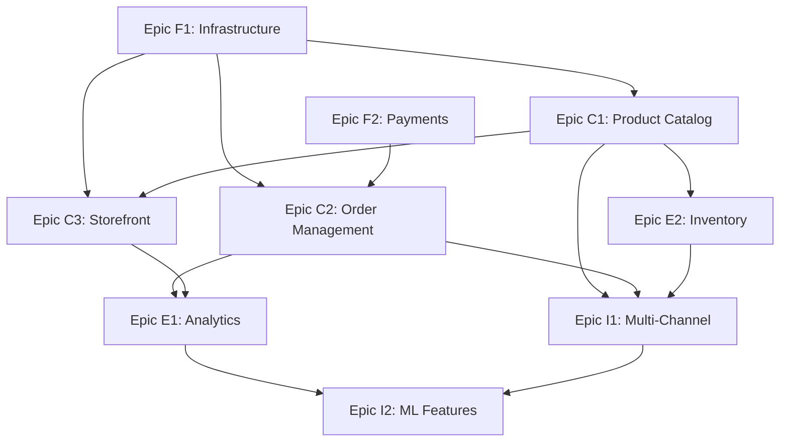

name: "E-Commerce Platform Epic Breakdown - Example"
description: |
Example project breakdown demonstrating Epic decomposition methodology.
Shows how a complex e-commerce platform is broken into independent,
parallelizable Epics for simultaneous development.

---

## Project Goal & Vision

**Project Name**: Modern E-Commerce Platform

**Vision Statement**: Create a scalable, modern e-commerce platform that enables businesses to sell products online with advanced inventory management, customer analytics, and multi-channel integration.

**Strategic Objectives**:

- Enable small-to-medium businesses to launch online stores in under 24 hours
- Support 10,000+ concurrent users with sub-2-second page load times
- Provide real-time inventory management across multiple sales channels
- Deliver actionable customer analytics and business intelligence

**Target Timeline**: 6 months for MVP, 12 months for full platform

**Team Structure**: 4 development teams (3-4 developers each), 2 AI agents for automation

## Project Scope Definition

### Core Business Capabilities

**Primary User Journeys**:

1. **Store Owner** → Create store, add products, manage orders → Revenue generation
2. **Customer** → Browse products, purchase items, track orders → Satisfied purchase experience
3. **Administrator** → Monitor platform, manage users, analyze performance → Platform optimization
4. **Inventory Manager** → Track stock, manage suppliers, forecast demand → Operational efficiency

**Key Business Rules**:

- **Inventory Consistency**: Stock levels must be accurate across all sales channels in real-time
- **Payment Security**: PCI DSS compliance for all payment processing
- **Multi-tenancy**: Complete data isolation between different store owners
- **Performance SLA**: 99.9% uptime with <2 second average response time

**Success Criteria**:

- [ ] **User Adoption**: 100+ active stores within 3 months of launch
- [ ] **Performance**: Handle 10,000 concurrent users with <2s page loads
- [ ] **Revenue**: Enable $1M+ in GMV within 6 months
- [ ] **Reliability**: 99.9% uptime SLA achievement

### Technology & Architecture Context

**Technology Stack**:

```yaml
frontend: React 19 with Next.js 15
backend: Node.js with Express/Fastify
database: PostgreSQL with Redis caching
infrastructure: AWS with Kubernetes
integration: REST APIs with GraphQL for complex queries
```

**Architectural Patterns**:

- **Architecture Style**: Microservices with API Gateway
- **Data Strategy**: Event-driven with CQRS for analytics
- **Integration Pattern**: Event streaming with API-first design
- **Security Model**: OAuth2 with JWT, multi-tenant RBAC

**Technical Constraints**:

- **Compliance**: PCI DSS for payment processing
- **Scalability**: Must support horizontal scaling to 100K+ users
- **Integration**: Must integrate with Shopify, Amazon, and eBay APIs

## Project Epic Breakdown

### Foundation Layer Epics

#### Epic F1: Platform Infrastructure & Security

**Epic Purpose**: Core platform infrastructure, authentication, and security foundation

**Business Value**: Enables all other Epics with secure, scalable foundation

**Key Capabilities**:

- Multi-tenant authentication and authorization system
- API Gateway with rate limiting and security controls
- Database infrastructure with automated backups and scaling
- Monitoring, logging, and alerting infrastructure
- CI/CD pipeline with automated testing and deployment

**Epic Dependencies**:

- **Upstream**: AWS account setup, domain configuration
- **Downstream**: All other Epics depend on this foundation

**Data Models**:

```yaml
entities:
  - User: { id, email, role, tenant_id, auth_tokens }
  - Tenant: { id, name, plan, settings, created_at }
  - AuditLog: { id, user_id, action, resource, timestamp }
```

**API Surface**:

```yaml
apis:
  - AuthAPI: /auth/* (login, register, refresh, permissions)
  - TenantAPI: /tenant/* (tenant management, configuration)
  - HealthAPI: /health/* (monitoring, status checks)
```

**Epic Success Criteria**:

- [ ] Multi-tenant authentication system operational
- [ ] API Gateway handling 1000+ RPS with security controls
- [ ] Monitoring dashboard showing platform health metrics
- [ ] CI/CD pipeline deploying to staging and production

**Estimated Epic Complexity**: L (Large)

**Parallelization Potential**: Medium (can split auth, infra, monitoring)

---

#### Epic F2: Payment Processing Foundation

**Epic Purpose**: Secure, PCI-compliant payment processing infrastructure

**Business Value**: Enables revenue generation for all store owners

**Key Capabilities**:

- PCI DSS compliant payment processing
- Multiple payment gateway integration (Stripe, PayPal, Square)
- Payment webhook handling and reconciliation
- Fraud detection and risk management
- Payment analytics and reporting

**Epic Dependencies**:

- **Upstream**: Epic F1 (authentication and tenant isolation)
- **Downstream**: Epic C2 (Order Management), Epic E1 (Analytics)

**Data Models**:

```yaml
entities:
  - PaymentGateway: { id, tenant_id, provider, credentials, config }
  - PaymentMethod: { id, customer_id, type, token, metadata }
  - Transaction: { id, order_id, amount, status, gateway_response }
```

**API Surface**:

```yaml
apis:
  - PaymentAPI: /payments/* (process, refund, capture)
  - GatewayAPI: /gateways/* (configure payment providers)
  - WebhookAPI: /webhooks/payment/* (gateway event handling)
```

**Epic Success Criteria**:

- [ ] PCI DSS compliance validation passed
- [ ] Integration with 3+ major payment gateways
- [ ] Payment processing handling 100+ transactions/minute
- [ ] Fraud detection reducing chargebacks by 80%

**Estimated Epic Complexity**: XL (Extra Large)

**Parallelization Potential**: High (can split by payment provider)

---

### Core Business Epics

#### Epic C1: Product Catalog Management

**Epic Purpose**: Product information management and catalog organization

**Business Value**: Core business capability enabling product sales

**Key Capabilities**:

- Product creation, editing, and lifecycle management
- Category and attribute management with flexible schema
- Product variants (size, color, etc.) and pricing rules
- Digital asset management (images, videos, documents)
- SEO optimization and product search functionality

**Epic Dependencies**:

- **Upstream**: Epic F1 (tenant isolation and auth)
- **Downstream**: Epic C3 (Storefront), Epic I1 (Multi-channel)

**User Personas Served**:

- Store Owner: Create and manage product catalogs
- Content Manager: Organize products and optimize for search

**Data Models**:

```yaml
entities:
  - Product: { id, tenant_id, name, description, status, seo_data }
  - Category: { id, tenant_id, name, parent_id, sort_order }
  - ProductVariant: { id, product_id, sku, price, attributes }
  - DigitalAsset: { id, product_id, type, url, alt_text }
```

**API Surface**:

```yaml
apis:
  - ProductAPI: /products/* (CRUD, search, bulk operations)
  - CategoryAPI: /categories/* (hierarchy management)
  - AssetAPI: /assets/* (upload, resize, CDN integration)
```

**Epic Success Criteria**:

- [ ] Support 10,000+ products per store with fast search
- [ ] Image processing pipeline handling 1GB+ uploads daily
- [ ] SEO-optimized product pages with structured data
- [ ] Product import/export supporting major formats

**Estimated Epic Complexity**: L (Large)

**Parallelization Potential**: High (can split product mgmt, assets, search)

---

#### Epic C2: Order Management System

**Epic Purpose**: Complete order lifecycle from cart to fulfillment

**Business Value**: Core revenue-generating workflow for businesses

**Key Capabilities**:

- Shopping cart and checkout flow optimization
- Order processing and status management
- Inventory reservation and allocation
- Shipping calculation and label generation
- Return and refund processing

**Epic Dependencies**:

- **Upstream**: Epic F2 (payment processing), Epic C1 (product catalog)
- **Downstream**: Epic E2 (Analytics), Epic I1 (Multi-channel sync)

**User Personas Served**:

- Customer: Complete purchases with optimal experience
- Store Owner: Manage orders and fulfillment efficiently
- Fulfillment Staff: Process orders and handle shipping

**Data Models**:

```yaml
entities:
  - Cart: { id, customer_id, items, expires_at, saved_for_later }
  - Order: { id, tenant_id, customer_id, status, totals, shipping_address }
  - OrderItem: { id, order_id, product_variant_id, quantity, price }
  - Shipment: { id, order_id, tracking_number, carrier, status }
```

**API Surface**:

```yaml
apis:
  - CartAPI: /cart/* (add items, calculate totals, save)
  - OrderAPI: /orders/* (create, update status, search)
  - FulfillmentAPI: /fulfillment/* (shipping, tracking, returns)
```

**Epic Success Criteria**:

- [ ] Cart abandonment rate under 65% (industry average: 70%)
- [ ] Order processing time under 2 minutes average
- [ ] 99.9% order accuracy (correct items, quantities, shipping)
- [ ] Support 1,000+ orders per hour during peak traffic

**Estimated Epic Complexity**: XL (Extra Large)

**Parallelization Potential**: High (can split cart, orders, fulfillment)

---

#### Epic C3: Customer Storefront

**Epic Purpose**: Customer-facing e-commerce experience

**Business Value**: The primary interface for customer acquisition and conversion

**Key Capabilities**:

- Responsive storefront with customizable themes
- Product discovery with search, filtering, and recommendations
- Customer account management and order history
- Mobile-optimized checkout and payment flow
- Performance optimization for SEO and conversion

**Epic Dependencies**:

- **Upstream**: Epic C1 (product catalog), Epic C2 (cart/checkout)
- **Downstream**: Epic E1 (Advanced features), Epic E3 (Mobile app)

**User Personas Served**:

- Customer: Browse and purchase products efficiently
- Store Owner: Customize storefront to match brand
- Marketing Manager: Optimize for conversion and SEO

**Data Models**:

```yaml
entities:
  - Storefront: { id, tenant_id, theme_config, domain, seo_settings }
  - Customer: { id, tenant_id, profile, preferences, addresses }
  - CustomerSession: { id, customer_id, cart_id, analytics_data }
  - Theme: { id, name, layouts, styles, customization_options }
```

**API Surface**:

```yaml
apis:
  - StorefrontAPI: /storefront/* (theme config, content mgmt)
  - CustomerAPI: /customers/* (registration, profile, history)
  - SearchAPI: /search/* (product search, filters, suggestions)
```

**Epic Success Criteria**:

- [ ] Page load times under 2 seconds on 3G networks
- [ ] Mobile conversion rates within 10% of desktop
- [ ] SEO scores 90+ for product and category pages
- [ ] Support 10,000+ concurrent shoppers per store

**Estimated Epic Complexity**: XL (Extra Large)

**Parallelization Potential**: High (can split themes, customer mgmt, search)

---

### Enhancement Layer Epics

#### Epic E1: Business Intelligence & Analytics

**Epic Purpose**: Advanced analytics and business intelligence for store optimization

**Business Value**: Data-driven insights for revenue optimization and customer understanding

**Key Capabilities**:

- Real-time sales and performance dashboards
- Customer behavior analytics and segmentation
- Inventory turnover and demand forecasting
- A/B testing framework for conversion optimization
- Custom reporting and data export capabilities

**Epic Dependencies**:

- **Upstream**: Epic C1, C2, C3 (all core data-generating Epics)
- **Downstream**: Epic I2 (ML-powered recommendations)

**Data Models**:

```yaml
entities:
  - AnalyticsEvent:
      { id, tenant_id, event_type, user_id, properties, timestamp }
  - Dashboard: { id, tenant_id, config, widgets, permissions }
  - Report: { id, tenant_id, type, parameters, schedule, recipients }
```

**API Surface**:

```yaml
apis:
  - AnalyticsAPI: /analytics/* (events, metrics, queries)
  - DashboardAPI: /dashboards/* (config, widgets, sharing)
  - ReportAPI: /reports/* (generation, scheduling, export)
```

**Epic Success Criteria**:

- [ ] Real-time dashboards updating within 30 seconds
- [ ] Customer segmentation identifying 5+ actionable segments
- [ ] Inventory forecasting accuracy above 85%
- [ ] A/B testing framework supporting 100+ concurrent tests

**Estimated Epic Complexity**: L (Large)

**Parallelization Potential**: Medium (can split dashboards, events, reporting)

---

#### Epic E2: Advanced Inventory Management

**Epic Purpose**: Sophisticated inventory tracking and supply chain optimization

**Business Value**: Operational efficiency and stock optimization for better margins

**Key Capabilities**:

- Multi-location inventory tracking
- Automated reorder points and purchase orders
- Supplier management and performance tracking
- Inventory valuation and cost accounting
- Barcode scanning and warehouse management

**Epic Dependencies**:

- **Upstream**: Epic C1 (product catalog), Epic C2 (order allocation)
- **Downstream**: Epic I1 (multi-channel inventory sync)

**Data Models**:

```yaml
entities:
  - InventoryLocation: { id, tenant_id, name, address, type }
  - StockLevel: { id, product_variant_id, location_id, quantity, reserved }
  - PurchaseOrder: { id, tenant_id, supplier_id, status, items, delivery_date }
  - Supplier: { id, tenant_id, name, contact_info, performance_metrics }
```

**API Surface**:

```yaml
apis:
  - InventoryAPI: /inventory/* (stock levels, reservations, transfers)
  - SupplierAPI: /suppliers/* (management, orders, performance)
  - WarehouseAPI: /warehouse/* (receiving, picking, shipping)
```

**Epic Success Criteria**:

- [ ] Inventory accuracy above 99% across all locations
- [ ] Stockout reduction by 80% through automated reordering
- [ ] Inventory turnover improvement by 25%
- [ ] Supplier performance tracking with SLA monitoring

**Estimated Epic Complexity**: L (Large)

**Parallelization Potential**: High (can split by location, supplier mgmt, automation)

---

### Integration Layer Epics

#### Epic I1: Multi-Channel Sales Integration

**Epic Purpose**: Synchronize sales across multiple channels (Amazon, eBay, Shopify)

**Business Value**: Expanded market reach and unified inventory management

**Key Capabilities**:

- Real-time inventory synchronization across channels
- Order import and unified order management
- Product listing optimization for each channel
- Pricing and promotion coordination
- Performance analytics across all channels

**Epic Dependencies**:

- **Upstream**: Epic C1 (products), Epic C2 (orders), Epic E2 (inventory)
- **Downstream**: Epic E1 (cross-channel analytics)

**Integration Patterns**:

```yaml
patterns:
  - EventDriven: Inventory changes trigger multi-channel updates
  - APIGateway: Unified interface for all external channel APIs
  - CQRS: Separate read/write models for channel optimization
```

**API Surface**:

```yaml
apis:
  - ChannelAPI: /channels/* (configuration, sync status, mapping)
  - SyncAPI: /sync/* (inventory, orders, products across channels)
```

**Epic Success Criteria**:

- [ ] Real-time inventory sync across 5+ major channels
- [ ] Order processing from all channels within single interface
- [ ] Channel-specific optimization increasing sales by 30%
- [ ] 99.9% sync reliability with conflict resolution

**Estimated Epic Complexity**: XL (Extra Large)

**Parallelization Potential**: High (can split by channel/marketplace)

---

## Epic Dependency Matrix

### Dependency Visualization



### Parallel Development Phases

**Phase 1 - Foundation (Weeks 1-6)**:

- Epic F1: Platform Infrastructure - Team Alpha (4 developers)
- Epic F2: Payment Processing - Team Beta (4 developers)

**Phase 2 - Core Business (Weeks 4-14)** _(Start as Foundation APIs stabilize)_:

- Epic C1: Product Catalog - Team Alpha (post F1 completion)
- Epic C2: Order Management - Team Beta + Gamma (6 developers)
- Epic C3: Customer Storefront - Team Delta (4 developers)

**Phase 3 - Enhancement (Weeks 12-20)** _(Start as Core Epics near completion)_:

- Epic E1: Analytics - Team Alpha (data specialists)
- Epic E2: Advanced Inventory - Team Beta (operations focus)

**Phase 4 - Integration (Weeks 16-24)** _(Requires stable Core APIs)_:

- Epic I1: Multi-Channel Integration - Teams Gamma + Delta (integration specialists)

---

## DEFINITIVE EPIC & FEATURE BREAKDOWN

### Epic List Summary

| Epic ID | Epic Name                          | Team Assignment    | Complexity | Duration | Dependencies |
| ------- | ---------------------------------- | ------------------ | ---------- | -------- | ------------ |
| **F1**  | Platform Infrastructure & Security | Team Alpha         | L          | 6 weeks  | None         |
| **F2**  | Payment Processing Foundation      | Team Beta          | XL         | 8 weeks  | None         |
| **C1**  | Product Catalog Management         | Team Alpha         | L          | 6 weeks  | F1           |
| **C2**  | Order Management System            | Team Gamma         | XL         | 8 weeks  | F1, F2, C1   |
| **C3**  | Customer Storefront                | Team Delta         | XL         | 8 weeks  | F1, C1       |
| **E1**  | Business Intelligence & Analytics  | Team Alpha         | L          | 6 weeks  | C1, C2, C3   |
| **E2**  | Advanced Inventory Management      | Team Beta          | L          | 6 weeks  | C1, C2       |
| **I1**  | Multi-Channel Sales Integration    | Team Gamma + Delta | XL         | 8 weeks  | C1, C2, E2   |

### EPIC F1: Platform Infrastructure & Security

**Epic Owner**: Team Alpha (4 developers)  
**Timeline**: Weeks 1-6  
**Implementation Commands**:

```bash
/planning-create "Epic F1: Platform Infrastructure & Security - multi-tenant authentication, API gateway, monitoring, CI/CD pipeline"
/create-base-prp "implement infrastructure Epic using PRPs/platform-infrastructure-prd.md"
```

**Definitive Feature List**:

1. **F1.1: Multi-Tenant Authentication System**

   - User registration and login with tenant isolation
   - JWT token management with refresh token rotation
   - Role-based access control (RBAC) with tenant-specific permissions
   - Password reset and email verification flows

2. **F1.2: API Gateway & Security**

   - Rate limiting per tenant and endpoint
   - Request/response logging and monitoring
   - API key management for external integrations
   - CORS configuration and security headers

3. **F1.3: Database Infrastructure**

   - PostgreSQL setup with automated backups
   - Connection pooling and read replicas
   - Database migration management
   - Data encryption at rest and in transit

4. **F1.4: Monitoring & Observability**

   - Application performance monitoring (APM)
   - Log aggregation and alerting
   - Health check endpoints for all services
   - Error tracking and notification system

5. **F1.5: CI/CD Pipeline**
   - Automated testing on pull requests
   - Deployment pipeline to staging and production
   - Environment-specific configuration management
   - Rollback capabilities and blue-green deployments

---

### EPIC F2: Payment Processing Foundation

**Epic Owner**: Team Beta (4 developers)  
**Timeline**: Weeks 1-8  
**Implementation Commands**:

```bash
/planning-create "Epic F2: Payment Processing Foundation - PCI compliance, multiple gateways, fraud detection"
/create-base-prp "implement payment Epic using PRPs/payment-processing-prd.md"
```

**Definitive Feature List**:

1. **F2.1: Payment Gateway Integration**

   - Stripe integration with webhooks
   - PayPal payment processing
   - Square payment terminal support
   - Gateway failover and redundancy

2. **F2.2: PCI DSS Compliance**

   - Secure payment form with tokenization
   - PCI DSS security assessment implementation
   - Audit logging for all payment operations
   - Data encryption and secure key management

3. **F2.3: Transaction Management**

   - Payment capture and authorization
   - Refund and void operations
   - Partial payment and installment support
   - Transaction reconciliation and reporting

4. **F2.4: Fraud Detection**

   - Real-time fraud scoring
   - Velocity checking and pattern analysis
   - Manual review queue for suspicious transactions
   - Integration with fraud prevention services

5. **F2.5: Payment Analytics**
   - Transaction success/failure rates
   - Payment method performance analysis
   - Chargeback tracking and management
   - Revenue reporting and forecasting

---

### EPIC C1: Product Catalog Management

**Epic Owner**: Team Alpha (4 developers)  
**Timeline**: Weeks 7-12 (after F1 completion)  
**Implementation Commands**:

```bash
/planning-create "Epic C1: Product Catalog Management - products, categories, variants, digital assets, search"
/create-base-prp "implement catalog Epic using PRPs/product-catalog-prd.md"
```

**Complete Feature List**: [All features needed for comprehensive product catalog implementation]

1. **C1.1: Product Management**

   - Product creation, editing, and lifecycle management
   - Product status workflow (draft, active, discontinued)
   - Bulk product import/export (CSV, JSON)
   - Product versioning and change history

2. **C1.2: Category & Attribute System**

   - Hierarchical category management
   - Custom product attributes and variants
   - Category-specific attribute templates
   - Tag-based product organization

3. **C1.3: Digital Asset Management**

   - Image upload with automatic resizing
   - Video and document attachment support
   - CDN integration for fast asset delivery
   - Alt text and SEO metadata for images

4. **C1.4: Product Search & Discovery**

   - Full-text search with autocomplete
   - Faceted search with filters
   - Search result ranking and optimization
   - Search analytics and query insights

5. **C1.5: SEO & Marketing**

   - SEO-friendly URLs and metadata
   - Structured data (Schema.org) markup
   - Product recommendations engine
   - Related products and cross-selling

6. **C1.6: Product Variants & Pricing**

   - Size, color, material variant management
   - Variant-specific pricing rules
   - SKU generation and management
   - Variant inventory tracking
   - Bulk variant operations

7. **C1.7: Product Reviews & Ratings**

   - Customer review submission and moderation
   - Rating aggregation and display
   - Review helpfulness voting
   - Photo/video review support
   - Review analytics and insights

8. **C1.8: Product Comparison**

   - Side-by-side product comparison
   - Comparison criteria configuration
   - Comparison history for customers
   - Export comparison data

9. **C1.9: Product Bundling & Kits**

   - Bundle creation and management
   - Kit pricing calculations
   - Bundle inventory management
   - Cross-sell bundle recommendations

10. **C1.10: Product Performance Analytics**

    - View and engagement tracking
    - Conversion rate by product
    - Search performance metrics
    - Category performance analysis
    - Inventory turnover insights

11. **C1.11: Product Content Management**

    - Rich text editor for descriptions
    - Multi-language product content
    - Content approval workflows
    - Product content templates
    - Content version control

12. **C1.12: Product Data Quality**
    - Mandatory field validation
    - Content quality scoring
    - Duplicate product detection
    - Data completeness monitoring
    - Product health dashboard

---

### EPIC C2: Order Management System

**Epic Owner**: Team Gamma (4 developers)  
**Timeline**: Weeks 9-16 (after F1, F2, C1 APIs ready)  
**Implementation Commands**:

```bash
/planning-create "Epic C2: Order Management System - cart, checkout, orders, fulfillment, returns"
/create-base-prp "implement order management using PRPs/order-management-prd.md"
```

**Definitive Feature List**:

1. **C2.1: Shopping Cart System**

   - Add/remove items with quantity management
   - Save cart for later and wishlist functionality
   - Cart abandonment tracking and recovery
   - Guest checkout and registered user carts

2. **C2.2: Checkout Process**

   - Multi-step checkout with progress indicator
   - Address management and validation
   - Shipping method selection and calculation
   - Tax calculation based on location

3. **C2.3: Order Processing**

   - Order creation and confirmation emails
   - Order status tracking and updates
   - Order modification and cancellation
   - Order history and reorder functionality

4. **C2.4: Inventory Management**

   - Real-time inventory checking
   - Inventory reservation during checkout
   - Stock level alerts and notifications
   - Backorder and preorder handling

5. **C2.5: Fulfillment & Shipping**
   - Shipping label generation
   - Tracking number management
   - Return merchandise authorization (RMA)
   - Fulfillment workflow automation

---

### EPIC C3: Customer Storefront

**Epic Owner**: Team Delta (4 developers)  
**Timeline**: Weeks 9-16 (after F1, C1 APIs ready)  
**Implementation Commands**:

```bash
/planning-create "Epic C3: Customer Storefront - responsive UI, product pages, customer accounts, performance"
/create-base-prp "implement storefront using PRPs/customer-storefront-prd.md"
```

**Definitive Feature List**:

1. **C3.1: Responsive Design System**

   - Mobile-first responsive design
   - Customizable theme engine
   - Brand customization tools
   - Accessibility compliance (WCAG 2.1)

2. **C3.2: Product Display Pages**

   - Product detail pages with image galleries
   - Product variant selection interface
   - Customer reviews and ratings
   - Social sharing and wishlist integration

3. **C3.3: Customer Account Management**

   - User registration and profile management
   - Order history and tracking
   - Address book and payment methods
   - Account preferences and notifications

4. **C3.4: Navigation & Search Interface**

   - Mega menu with category browsing
   - Search interface with filters
   - Breadcrumb navigation
   - Recently viewed products

5. **C3.5: Performance Optimization**
   - Page load optimization (< 2 seconds)
   - Image lazy loading and optimization
   - CDN integration for static assets
   - SEO optimization and meta tags

---

### EPIC E1: Business Intelligence & Analytics

**Epic Owner**: Team Alpha (4 developers)  
**Timeline**: Weeks 17-22 (after core business Epics)  
**Implementation Commands**:

```bash
/planning-create "Epic E1: Business Intelligence & Analytics - dashboards, reports, customer insights, A/B testing"
/create-base-prp "implement analytics using PRPs/business-intelligence-prd.md"
```

**Definitive Feature List**:

1. **E1.1: Real-Time Dashboards**

   - Sales performance dashboard
   - Inventory status monitoring
   - Customer behavior analytics
   - Revenue and conversion metrics

2. **E1.2: Customer Analytics**

   - Customer segmentation and profiling
   - Purchase behavior analysis
   - Customer lifetime value (CLV) calculation
   - Churn prediction and retention metrics

3. **E1.3: Product Performance Analytics**

   - Best-selling products analysis
   - Product performance trends
   - Inventory turnover rates
   - Price optimization insights

4. **E1.4: A/B Testing Framework**

   - Feature flag management
   - Experiment setup and tracking
   - Statistical significance testing
   - Conversion rate optimization

5. **E1.5: Custom Reporting**
   - Report builder with drag-and-drop
   - Scheduled report generation
   - Data export capabilities (CSV, PDF)
   - Custom KPI tracking

---

### EPIC E2: Advanced Inventory Management

**Epic Owner**: Team Beta (4 developers)  
**Timeline**: Weeks 17-22 (after C1, C2 completion)  
**Implementation Commands**:

```bash
/planning-create "Epic E2: Advanced Inventory Management - multi-location, suppliers, automation, forecasting"
/create-base-prp "implement inventory management using PRPs/advanced-inventory-prd.md"
```

**Definitive Feature List**:

1. **E2.1: Multi-Location Inventory**

   - Multiple warehouse/store locations
   - Location-based inventory tracking
   - Inter-location transfer management
   - Location-specific availability display

2. **E2.2: Supplier Management**

   - Supplier database and contact management
   - Purchase order creation and tracking
   - Supplier performance metrics
   - Automated reorder point notifications

3. **E2.3: Inventory Automation**

   - Automatic reorder based on rules
   - Low stock alerts and notifications
   - Demand forecasting algorithms
   - Seasonal adjustment capabilities

4. **E2.4: Warehouse Management**

   - Barcode scanning integration
   - Pick, pack, and ship workflows
   - Receiving and put-away processes
   - Cycle counting and audit trails

5. **E2.5: Inventory Analytics**
   - Inventory turnover analysis
   - Dead stock identification
   - Demand pattern analysis
   - Cost analysis and optimization

---

### EPIC I1: Multi-Channel Sales Integration

**Epic Owner**: Teams Gamma + Delta (8 developers)  
**Timeline**: Weeks 21-28 (after core business Epics)  
**Implementation Commands**:

```bash
/planning-create "Epic I1: Multi-Channel Integration - Amazon, eBay, Shopify sync, unified inventory"
/create-base-prp "implement multi-channel using PRPs/multi-channel-integration-prd.md"
```

**Definitive Feature List**:

1. **I1.1: Amazon Marketplace Integration**

   - Product listing synchronization
   - Order import and fulfillment
   - Inventory sync with Amazon FBA
   - Performance metrics tracking

2. **I1.2: eBay Integration**

   - Listing management and optimization
   - Order processing automation
   - Inventory synchronization
   - Fee calculation and reporting

3. **I1.3: Shopify Integration**

   - Product catalog synchronization
   - Order and customer data sync
   - Inventory level management
   - App store integration

4. **I1.4: Unified Inventory Management**

   - Real-time inventory sync across channels
   - Channel-specific pricing rules
   - Allocation and reservation management
   - Conflict resolution automation

5. **I1.5: Channel Performance Analytics**
   - Sales performance by channel
   - Channel-specific customer insights
   - Profitability analysis per channel
   - Cross-channel customer journey tracking

---

## Implementation Roadmap

### Phase 1: Foundation (Weeks 1-8)

```bash
# Start simultaneously
/planning-create "Epic F1: Platform Infrastructure & Security"
/planning-create "Epic F2: Payment Processing Foundation"

# Team Alpha implements F1
/create-base-prp "implement F1 using PRPs/platform-infrastructure-prd.md"
/execute-base-prp PRPs/platform-infrastructure-implementation.md

# Team Beta implements F2
/create-base-prp "implement F2 using PRPs/payment-processing-prd.md"
/execute-base-prp PRPs/payment-processing-implementation.md
```

### Phase 2: Core Business (Weeks 7-16)

```bash
# Team Alpha (post F1) implements C1
/planning-create "Epic C1: Product Catalog Management"
/create-base-prp "implement C1 using PRPs/product-catalog-prd.md"
/execute-base-prp PRPs/product-catalog-implementation.md

# Team Gamma implements C2 (requires F1, F2, C1 APIs)
/planning-create "Epic C2: Order Management System"
/create-base-prp "implement C2 using PRPs/order-management-prd.md"
/execute-base-prp PRPs/order-management-implementation.md

# Team Delta implements C3 (requires F1, C1 APIs)
/planning-create "Epic C3: Customer Storefront"
/create-base-prp "implement C3 using PRPs/customer-storefront-prd.md"
/execute-base-prp PRPs/customer-storefront-implementation.md
```

### Phase 3: Enhancement (Weeks 17-22)

```bash
# Team Alpha implements E1
/planning-create "Epic E1: Business Intelligence & Analytics"
/create-base-prp "implement E1 using PRPs/business-intelligence-prd.md"
/execute-base-prp PRPs/business-intelligence-implementation.md

# Team Beta implements E2
/planning-create "Epic E2: Advanced Inventory Management"
/create-base-prp "implement E2 using PRPs/advanced-inventory-prd.md"
/execute-base-prp PRPs/advanced-inventory-implementation.md
```

### Phase 4: Integration (Weeks 21-28)

```bash
# Teams Gamma + Delta implement I1
/planning-create "Epic I1: Multi-Channel Sales Integration"
/create-base-prp "implement I1 using PRPs/multi-channel-integration-prd.md"
/execute-base-prp PRPs/multi-channel-integration-implementation.md
```

---

**This definitive breakdown provides 8 Epics with 40 specific features that can be implemented using the standard PRP workflow. Each Epic has clear ownership, dependencies, and implementation commands for immediate execution.**

## Next Steps

1. **Epic Validation**: Review Epic boundaries with stakeholders and technical leads

2. **Team Formation**: Assign Epic ownership based on team strengths:

   ```
   Team Alpha: Infrastructure + Analytics (systems expertise)
   Team Beta: Payments + Inventory (transaction/ops expertise)
   Team Gamma: Orders (business logic expertise)
   Team Delta: Storefront (frontend/UX expertise)
   ```

3. **Epic Feature Breakdown**: For each Epic, run detailed planning:

   ```
   /planning-create Epic C1: Product Catalog Management with multi-tenant architecture
   /planning-create Epic C2: Order Management System with payment integration
   /planning-create Epic C3: Customer Storefront with performance optimization
   ```

4. **API Contract Definition**: Establish Epic API contracts before implementation begins

5. **Integration Testing Strategy**: Define cross-Epic integration validation approach

---

**This breakdown enables 4 teams to work in parallel with minimal coordination overhead while building a comprehensive e-commerce platform. Each Epic delivers independent business value while contributing to the overall platform vision.**
