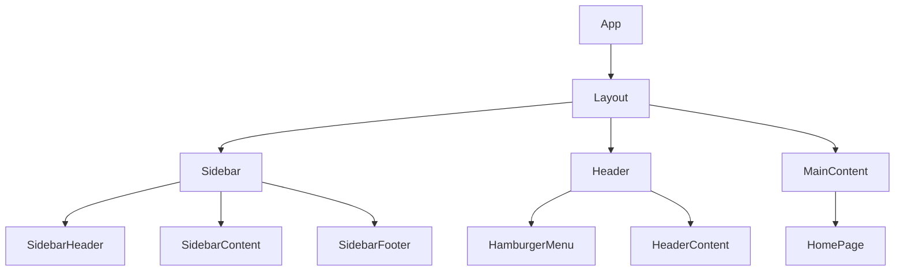

name: "Sidebar React App Planning"
description: |
Planning document for creating a React app with a responsive collapsible sidebar,
following the design reference from adminmart.com.

---

## Goal

Create a clean, modern React application template with a responsive collapsible sidebar that works seamlessly on both desktop and mobile devices.

### Success Definition

- Responsive sidebar that collapses/expands on desktop
- Auto-collapses on mobile with hamburger menu
- Smooth transitions for collapse/expand actions
- Clean, minimal home page layout
- TypeScript for type safety
- Modern React best practices

## Why

A well-designed sidebar navigation is crucial for:

- Efficient navigation in web applications
- Optimal use of screen real estate
- Improved mobile user experience
- Foundation for future feature additions

## What

### Core Features

1. **Responsive Sidebar**

   - Collapsible/expandable on desktop
   - Auto-hidden on mobile with hamburger menu
   - Smooth animations for state changes
   - Proper touch support for mobile

2. **Layout Components**

   - Main app container
   - Sidebar component
   - Header with toggle button
   - Content area with proper spacing

3. **Home Page**
   - Clean, minimal design
   - Proper layout structure
   - Responsive behavior

### Technical Requirements

1. **Framework & Libraries**

   - React 18+ with TypeScript
   - Vite for fast development
   - TailwindCSS for styling
   - React Icons for iconography

2. **Core Components**

   ```typescript
   interface SidebarProps {
     isOpen: boolean;
     onToggle: () => void;
     items?: MenuItem[];
   }

   interface MenuItem {
     id: string;
     label: string;
     icon?: React.ReactNode;
     path: string;
   }

   interface LayoutProps {
     children: React.ReactNode;
   }
   ```

3. **Responsive Breakpoints**
   - Mobile: < 768px (sidebar hidden by default)
   - Tablet: 768px - 1024px (collapsible sidebar)
   - Desktop: > 1024px (expanded sidebar by default)

## Component Breakdown

### Frontend Components



- **Layout**: Main app layout container

  - Purpose: Manages overall layout structure
  - Key features: Responsive grid, sidebar state management

- **Sidebar**: Collapsible navigation sidebar

  - Purpose: Main navigation component
  - Key features: Collapse/expand, mobile responsiveness

- **Header**: Top app bar

  - Purpose: Contains hamburger menu and app header
  - Key features: Responsive design, sidebar toggle

- **MainContent**: Content area
  - Purpose: Displays page content
  - Key features: Responsive margins/padding based on sidebar state

## Technical Architecture

### Directory Structure

```bash
app/
├── src/
│   ├── components/
│   │   ├── layout/
│   │   │   ├── Layout.tsx       # Main layout wrapper
│   │   │   ├── Header.tsx       # Top header with toggle
│   │   │   └── Sidebar.tsx      # Collapsible sidebar
│   │   └── ui/                  # Reusable UI components
│   ├── hooks/
│   │   └── useSidebar.ts        # Sidebar state management
│   ├── styles/
│   │   └── globals.css          # Global styles and utilities
│   ├── pages/
│   │   └── Home.tsx             # Home page component
│   └── App.tsx                  # Main app component
└── index.html
```

### State Management

```typescript
// Simple sidebar state management with React Context
interface SidebarContext {
  isOpen: boolean;
  isMobile: boolean;
  toggleSidebar: () => void;
}
```

### Styling Strategy

1. **TailwindCSS for Responsive Design**

   ```css
   /* Base sidebar styles */
   .sidebar {
     @apply fixed md:relative h-full transition-all duration-300;
   }

   /* Collapsed state */
   .sidebar-collapsed {
     @apply w-20;
   }

   /* Expanded state */
   .sidebar-expanded {
     @apply w-64;
   }
   ```

2. **Mobile-First Approach**
   - Default: Full-width sidebar when open on mobile
   - Tablet+: Collapsible sidebar with fixed widths
   - Smooth transitions for all state changes

## Implementation Priority

1. **Foundation (P0)**

   - Project setup with Vite & TypeScript
   - TailwindCSS configuration
   - Base layout structure

2. **Core Components (P1)**

   - Sidebar component with collapse/expand
   - Header with hamburger menu
   - Main content area

3. **Responsive Behavior (P2)**

   - Mobile responsiveness
   - Touch gesture support
   - Smooth animations

4. **Home Page (P3)**
   - Clean homepage layout
   - Responsive content area
   - Basic routing setup

## Anti-Patterns to Avoid

1. **Layout Anti-Patterns**

   - ❌ Hard-coded pixel values for responsive breakpoints
   - ❌ Layout shifts during sidebar transitions
   - ❌ Non-accessible hamburger menu
   - ❌ Blocking main thread during animations

2. **State Management Anti-Patterns**

   - ❌ Complex global state for simple sidebar toggle
   - ❌ Prop drilling for sidebar state
   - ❌ Unnecessary re-renders during transitions

3. **Mobile Anti-Patterns**
   - ❌ Non-touch-friendly interactions
   - ❌ Sidebar blocking content on mobile
   - ❌ Poor performance on mobile devices

## Success Indicators

### Technical Success

- [ ] TypeScript compilation passes with no errors
- [ ] Responsive design works on all target breakpoints
- [ ] Smooth animations with no layout shifts
- [ ] Passes basic accessibility checks

### UX Success

- [ ] Sidebar toggles smoothly on desktop
- [ ] Mobile navigation works intuitively
- [ ] No content blocking during transitions
- [ ] Touch gestures work naturally on mobile

### Performance Success

- [ ] Quick initial load time
- [ ] Smooth animations (60fps)
- [ ] No unnecessary re-renders
- [ ] Efficient touch event handling

## Next Steps

1. Execute this plan using `/api-contract-define` to define component interfaces
2. Create implementation plan with `/prp-base-create`
3. Build the feature with `/prp-base-execute`
4. Validate success indicators
5. Iterate based on feedback

The focus is on creating a solid foundation for the app with a well-designed, responsive sidebar that can scale with future feature additions.
