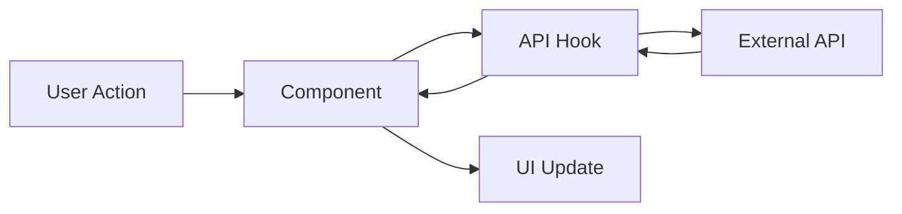

# Documentation Template for Features and Epics

> **MANDATORY**: Use this template when creating documentation for completed features or epics in React projects.
> Place documentation files in `app/docs/` folder with naming convention: `{feature-name}-documentation.md` or `{epic-name}-documentation.md`

---

# {Feature/Epic Name} Documentation

**Type**: [Feature | Epic | Task]  
**Completed**: {Date}  
**Developer**: {Name/Team}  
**PRP Reference**: {Link to completed PRP file in PRPs/completed/}

## Overview

Brief description of the feature/epic and its business value.

**Business Value:**
- Primary problem solved
- User benefit delivered
- Integration with existing features

**Scope:**
- What was included in this implementation
- What was explicitly excluded (future work)

## Components Created/Modified

### New Components

- **ComponentName** (`src/path/to/component.tsx`)
  - Purpose: [Brief description]
  - Props: [Key props and their types]
  - Usage: [When and where to use]

```tsx
// Usage example
<ComponentName 
  prop1="value" 
  prop2={data}
  onAction={handleAction}
/>
```

### Modified Components

- **ExistingComponent** (`src/path/to/existing.tsx`)
  - Changes: [What was modified and why]
  - Breaking changes: [Any interface changes]
  - Migration: [How to update existing usage]

## API Integration

### External APIs Used

- **API Name**: {Base URL}
  - Endpoints: `GET /api/endpoint`, `POST /api/resource`
  - Authentication: [Method used]
  - Rate limiting: [If applicable]
  - Error handling: [How errors are managed]

### Data Flow Patterns



### Key Implementation Details

```typescript
// Example API integration pattern
const useFeatureData = () => {
  return useQuery({
    queryKey: ['feature-data'],
    queryFn: async () => {
      const response = await fetch('/api/feature');
      if (!response.ok) {
        throw new Error('Failed to fetch feature data');
      }
      return response.json();
    },
    // Additional configuration
  });
};
```

## State Management

### Local State

- Component-level state patterns used
- State lifting decisions and rationale
- Context providers created (if any)

### Global State

- Global state additions/modifications
- Store structure changes
- Side effects and async operations

## Testing Coverage

### Unit Tests

- **Coverage**: {Percentage}%
- **Files tested**: {Number} of {Total} files
- **Key test scenarios**:
  - Happy path functionality
  - Error conditions
  - Edge cases
  - Component rendering

### Integration Tests

- **API integration**: [Tested endpoints and scenarios]
- **Component integration**: [Inter-component communication tests]
- **State management**: [State updates and side effects]

### E2E Tests

- **User journeys covered**:
  - Primary user flow
  - Error scenarios
  - Edge cases
  
```typescript
// Example E2E test pattern
test('user can complete feature workflow', async ({ page }) => {
  await page.goto('/feature');
  await page.getByTestId('feature-trigger').click();
  await expect(page.getByTestId('feature-result')).toBeVisible();
});
```

## Dependencies

### New Dependencies Added

```json
{
  "dependency-name": "^version",
  "description": "Purpose and why it was chosen"
}
```

### Configuration Changes

- Environment variables added
- Config file modifications
- Build process changes

### Third-party Integrations

- External service configurations
- API keys and authentication setup
- Webhook configurations

## Usage Examples

### Basic Usage

```tsx
import { FeatureComponent } from '@/features/feature-name';

function App() {
  return (
    <div>
      <FeatureComponent 
        data={data}
        onComplete={handleComplete}
      />
    </div>
  );
}
```

### Advanced Usage

```tsx
// Complex integration example
const AdvancedFeatureUsage = () => {
  const { data, isLoading, error } = useFeatureData();
  const [localState, setLocalState] = useState(null);

  const handleFeatureAction = useCallback(async (input) => {
    try {
      const result = await featureService.processAction(input);
      setLocalState(result);
    } catch (error) {
      console.error('Feature action failed:', error);
    }
  }, []);

  if (isLoading) return <LoadingSpinner />;
  if (error) return <ErrorMessage error={error} />;

  return (
    <FeatureComponent
      data={data}
      localState={localState}
      onAction={handleFeatureAction}
    />
  );
};
```

## Performance Considerations

### Optimizations Implemented

- Code splitting strategies
- Lazy loading patterns
- Memoization usage
- Bundle size impact

### Performance Metrics

- Initial load time impact
- Runtime performance characteristics
- Memory usage considerations
- Network request patterns

## Security Considerations

### Input Validation

- Zod schemas used
- Sanitization patterns
- File upload restrictions (if applicable)

### Data Protection

- Sensitive data handling
- Local storage usage
- API security measures

## Troubleshooting

### Common Issues

**Issue**: {Description of common problem}
- **Symptoms**: {How it manifests}
- **Cause**: {Root cause}
- **Solution**: {Step-by-step fix}

```typescript
// Code example of the fix
const problematicPattern = () => {
  // Wrong way
};

const correctPattern = () => {
  // Right way
};
```

### Debug Patterns

```typescript
// Debugging utility for feature
const debugFeature = (context: string, data: any) => {
  if (process.env.NODE_ENV === 'development') {
    console.group(`🔍 Feature Debug: ${context}`);
    console.log('Data:', data);
    console.log('Timestamp:', new Date().toISOString());
    console.groupEnd();
  }
};
```

### Known Limitations

- Current implementation constraints
- Browser compatibility considerations
- Performance limitations
- Future improvement opportunities

## Future Enhancements

### Planned Improvements

- [ ] {Enhancement 1}
- [ ] {Enhancement 2}
- [ ] {Enhancement 3}

### Technical Debt

- Code areas that need refactoring
- Performance optimization opportunities
- Testing coverage gaps

## Related Documentation

- [Related Feature Documentation](./related-feature-documentation.md)
- [API Documentation](./api-integration.md)
- [Testing Guide](./testing-guide.md)
- [Component Library](./component-library.md)

## Support and Maintenance

### Key Files to Monitor

- `src/features/{feature-name}/` - Main feature code
- `src/components/{shared-components}` - Shared components
- `tests/e2e/{feature-tests}` - E2E test files

### Monitoring and Alerts

- Error tracking setup
- Performance monitoring
- User analytics (if applicable)

---

**Last Updated**: {Date}  
**Next Review**: {Date + 3 months}  
**Maintainer**: {Team/Individual responsible}
