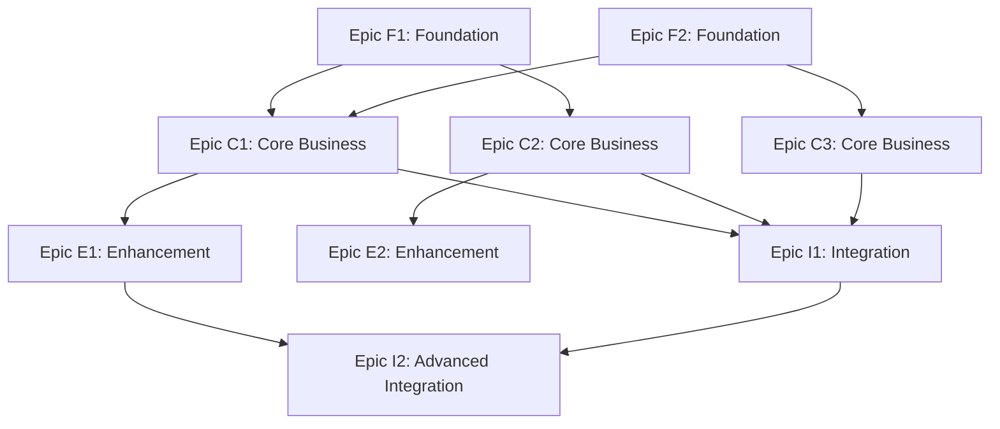

name: "Project Epic Breakdown Template - Enterprise-Level Planning"
description: |
Strategic project decomposition into independent, parallelizable Epics.
Designed for complex multi-developer/agent projects requiring architectural coordination.
Produces Epic roadmaps that can be developed simultaneously without blocking dependencies.
Each Epic can then be broken down into features using prp_planning.md template.

---

## Project Goal & Vision

**Project Name**: [Comprehensive project name]

**Vision Statement**: [High-level project vision - what this system will achieve]

**Strategic Objectives**: [Business goals and success metrics this project will deliver]

**Target Timeline**: [Overall project timeline - quarters, months, or delivery phases]

**Team Structure**: [Number of developers/agents, team organization, parallel work capacity]

## Project Scope Definition

### Core Business Capabilities

**Primary User Journeys**: [3-5 core user flows this system must support]

1. [Journey 1]: [User type] → [Action] → [Outcome]
2. [Journey 2]: [User type] → [Action] → [Outcome]
3. [Journey 3]: [User type] → [Action] → [Outcome]

**Key Business Rules**: [Critical business logic and constraints]

- [Rule 1]: [Business constraint or requirement]
- [Rule 2]: [Data governance or compliance requirement]
- [Rule 3]: [Performance or scale requirement]

**Success Criteria**: [Measurable outcomes that define project success]

- [ ] [Metric 1]: [Specific, measurable outcome]
- [ ] [Metric 2]: [User adoption or performance target]
- [ ] [Metric 3]: [Technical or business milestone]

### Technology & Architecture Context

**Technology Stack**: [High-level technology choices]

```yaml
# Core Technology Decisions
frontend: [React 19/Next.js/Vue/Angular]
backend: [Node.js/Python/Java/C#/.NET]
database: [PostgreSQL/MongoDB/MySQL/Redis]
infrastructure: [AWS/Azure/GCP/Docker/Kubernetes]
integration: [REST APIs/GraphQL/gRPC/Event Streaming]
```

**Architectural Patterns**: [Key architectural decisions]

- **Architecture Style**: [Microservices/Monolithic/Serverless/Event-Driven]
- **Data Strategy**: [CQRS/Event Sourcing/Traditional CRUD/Hybrid]
- **Integration Pattern**: [API Gateway/Service Mesh/Direct Integration]
- **Security Model**: [OAuth2/JWT/RBAC/Multi-tenant/Zero-trust]

**Technical Constraints**: [Known technical limitations or requirements]

- [Constraint 1]: [Performance, security, or compliance requirement]
- [Constraint 2]: [Integration or platform limitation]
- [Constraint 3]: [Resource or technology constraint]

## Epic Decomposition Strategy

### Independence Criteria

**For each Epic to be truly independent, it must have:**

- [ ] **Data Independence**: Own data models with minimal cross-Epic dependencies
- [ ] **API Boundaries**: Clear, stable interfaces with other Epics
- [ ] **Deployment Independence**: Can be deployed and updated separately
- [ ] **Team Independence**: Can be developed by separate teams without constant coordination
- [ ] **Testing Independence**: Can be tested in isolation with mocked dependencies

### Epic Priority Framework

**Priority Levels**:

1. **Foundation Epics**: Core infrastructure and shared services (Must be first)
2. **Core Epics**: Primary business value delivery (High parallelization potential)
3. **Enhancement Epics**: Additional features and optimizations (Can be deferred)
4. **Integration Epics**: Cross-Epic workflows and orchestration (Depends on Core Epics)

## Project Epic Breakdown

### Foundation Layer Epics

#### Epic F1: [Foundation Epic Name]

**Epic Purpose**: [Infrastructure, shared services, or architectural foundation]

**Business Value**: [How this Epic enables other Epics and delivers foundational value]

**Key Capabilities**:

- [Capability 1]: [Core infrastructure component]
- [Capability 2]: [Shared service or platform feature]
- [Capability 3]: [Security, monitoring, or operational foundation]

**Epic Dependencies**:

- **Upstream**: [What must exist before this Epic can start]
- **Downstream**: [What Epics depend on this Epic's completion]

**Data Models**: [Core data entities this Epic owns]

```yaml
# Primary entities managed by this Epic
entities:
  - [Entity1]: [Core attributes and relationships]
  - [Entity2]: [Core attributes and relationships]
```

**API Surface**: [External interfaces this Epic provides]

```yaml
# Public APIs provided by this Epic
apis:
  - [API Name]: [Purpose and key endpoints]
  - [Service Name]: [Integration points for other Epics]
```

**Epic Success Criteria**:

- [ ] [Foundation requirement 1]: [Infrastructure capability delivered]
- [ ] [Foundation requirement 2]: [Shared service operational]
- [ ] [Foundation requirement 3]: [Other Epics can integrate successfully]

**Estimated Epic Complexity**: [T-shirt size: XS/S/M/L/XL/XXL]

**Parallelization Potential**: [None/Low/Medium/High - ability to split across developers]

---

#### Epic F2: [Second Foundation Epic]

[Follow same structure as Epic F1]

### Core Business Epics

#### Epic C1: [Core Business Epic Name]

**Epic Purpose**: [Primary business capability or user journey]

**Business Value**: [Direct user value and business impact]

**Key Capabilities**:

- [Capability 1]: [Core user-facing feature]
- [Capability 2]: [Business logic or workflow]
- [Capability 3]: [Data management or integration]

**Epic Dependencies**:

- **Upstream**: [Foundation Epics or external systems required]
- **Downstream**: [Enhancement Epics that build on this Epic]

**User Personas Served**: [Primary users who benefit from this Epic]

- [Persona 1]: [User type and primary use cases]
- [Persona 2]: [User type and primary use cases]

**Data Models**: [Business entities this Epic owns]

```yaml
# Business entities managed by this Epic
entities:
  - [BusinessEntity1]: [Core attributes, relationships, business rules]
  - [BusinessEntity2]: [Core attributes, relationships, business rules]
```

**API Surface**: [Business APIs this Epic provides]

```yaml
# Business APIs provided by this Epic
apis:
  - [BusinessAPI]: [Core business operations exposed]
  - [IntegrationAPI]: [Cross-Epic integration points]
```

**Epic Success Criteria**:

- [ ] [Business outcome 1]: [User capability or workflow completed]
- [ ] [Business outcome 2]: [Performance or scale target met]
- [ ] [Business outcome 3]: [Integration or data requirement satisfied]

**Estimated Epic Complexity**: [T-shirt size: XS/S/M/L/XL/XXL]

**Parallelization Potential**: [None/Low/Medium/High - ability to split across developers]

---

#### Epic C2: [Second Core Epic]

[Follow same structure as Epic C1]

#### Epic C3: [Third Core Epic]

[Follow same structure as Epic C1]

### Enhancement Layer Epics

#### Epic E1: [Enhancement Epic Name]

**Epic Purpose**: [Advanced features, optimizations, or user experience improvements]

**Business Value**: [Competitive advantage or user satisfaction improvement]

**Key Capabilities**:

- [Enhancement 1]: [Advanced feature or optimization]
- [Enhancement 2]: [User experience improvement]
- [Enhancement 3]: [Performance or operational enhancement]

**Epic Dependencies**:

- **Upstream**: [Core Epics that must be complete]
- **Downstream**: [Future enhancements or integrations]

**Data Models**: [Additional data entities or extensions]

```yaml
# Enhancement entities or extensions
entities:
  - [EnhancementEntity]: [Advanced data models or analytics]
```

**API Surface**: [Enhanced APIs or new capabilities]

```yaml
# Enhanced APIs provided by this Epic
apis:
  - [EnhancedAPI]: [Advanced operations or integrations]
```

**Epic Success Criteria**:

- [ ] [Enhancement outcome 1]: [Advanced capability delivered]
- [ ] [Enhancement outcome 2]: [Performance improvement achieved]
- [ ] [Enhancement outcome 3]: [User experience metric improved]

**Estimated Epic Complexity**: [T-shirt size: XS/S/M/L/XL/XXL]

**Parallelization Potential**: [None/Low/Medium/High - ability to split across developers]

---

### Integration Layer Epics

#### Epic I1: [Integration Epic Name]

**Epic Purpose**: [Cross-Epic workflows, orchestration, or complex integrations]

**Business Value**: [End-to-end user workflows or system orchestration value]

**Key Capabilities**:

- [Integration 1]: [Cross-Epic workflow or orchestration]
- [Integration 2]: [Complex business process spanning multiple Epics]
- [Integration 3]: [External system integration or data synchronization]

**Epic Dependencies**:

- **Upstream**: [Multiple Core Epics that must provide stable APIs]
- **Downstream**: [Monitoring, analytics, or reporting capabilities]

**Integration Patterns**: [How this Epic coordinates between other Epics]

```yaml
# Integration patterns and orchestration
patterns:
  - [Pattern1]: [Saga/Event-driven/Orchestration pattern used]
  - [Pattern2]: [Data synchronization or workflow coordination]
```

**API Surface**: [Orchestration or workflow APIs]

```yaml
# Orchestration APIs provided by this Epic
apis:
  - [WorkflowAPI]: [End-to-end business process management]
  - [OrchestrationAPI]: [Cross-Epic coordination and state management]
```

**Epic Success Criteria**:

- [ ] [Integration outcome 1]: [End-to-end workflow operational]
- [ ] [Integration outcome 2]: [Cross-Epic consistency maintained]
- [ ] [Integration outcome 3]: [Performance and reliability targets met]

**Estimated Epic Complexity**: [T-shirt size: XS/S/M/L/XL/XXL]

**Parallelization Potential**: [None/Low/Medium/High - ability to split across developers]

---

## Epic Dependency Matrix

### Dependency Visualization



### Parallel Development Phases

**Phase 1 - Foundation (Weeks 1-4)**:

- Epic F1: [Foundation Epic Name] - Team Alpha
- Epic F2: [Foundation Epic Name] - Team Beta

**Phase 2 - Core Development (Weeks 3-12)** _(Can start as Foundation APIs stabilize)_:

- Epic C1: [Core Epic Name] - Team Alpha + 1 developer
- Epic C2: [Core Epic Name] - Team Beta + 1 developer
- Epic C3: [Core Epic Name] - Team Gamma (new team)

**Phase 3 - Enhancement & Integration (Weeks 10-16)** _(Can start as Core Epics near completion)_:

- Epic E1: [Enhancement Epic Name] - Available developers
- Epic E2: [Enhancement Epic Name] - Available developers
- Epic I1: [Integration Epic Name] - Integration specialists

**Phase 4 - Advanced Features (Weeks 14-20)**:

- Epic I2: [Advanced Integration] - Full team coordination

## Epic Feature Breakdown Process

### From Epic to Features (Using prp_planning.md)

For each Epic identified above, use the following process to break down into implementable features:

1. **Take Epic scope and capabilities**
2. **Run prp_planning.md template** with Epic context:
   ```
   /planning-create Epic [Epic-Name]: [Epic Purpose and Key Capabilities]
   ```
3. **Generate Epic-specific feature breakdown**
4. **Validate feature independence within Epic boundaries**
5. **Create implementation roadmap for Epic**

### Feature-Level PRP Generation

Once features are identified from Epic breakdown:

1. **For each feature**, create detailed PRP:
   ```
   /create-base-prp [Feature Description] with Epic [Epic-Name] context
   ```
2. **Ensure feature PRPs include**:
   - Epic context and API boundaries
   - Cross-Epic integration points
   - Epic-level data model consistency
   - Epic success criteria alignment

## Project Validation Gates

### Epic Independence Validation

Before proceeding with Epic development:

- [ ] **API Contract Validation**: All Epic APIs are well-defined and stable
- [ ] **Data Model Validation**: Data ownership is clear with minimal cross-Epic dependencies
- [ ] **Dependency Validation**: Epic dependency graph is acyclic and clearly understood
- [ ] **Team Assignment Validation**: Each Epic has dedicated team ownership
- [ ] **Integration Point Validation**: Cross-Epic integration patterns are architected

### Project Progress Validation

**Weekly Epic Health Checks**:

```bash
# Validate Epic progress and dependencies
npm run epic-health-check
npm run dependency-validation
npm run integration-test-suite
```

**Epic Completion Criteria**:

- [ ] All Epic features delivered and tested
- [ ] Epic APIs stable and documented
- [ ] Cross-Epic integration points validated
- [ ] Epic success criteria met
- [ ] Epic ready for dependent Epic development

### Project Success Validation

**Final Project Validation**:

- [ ] All Epic success criteria achieved
- [ ] End-to-end user journeys operational
- [ ] Performance and scale targets met
- [ ] Security and compliance requirements satisfied
- [ ] Documentation and operational runbooks complete
- [ ] Team knowledge transfer completed

---

## DEFINITIVE EPIC & FEATURE BREAKDOWN

### Epic List Summary

| Epic ID   | Epic Name     | Team Assignment   | Complexity     | Duration | Dependencies   |
| --------- | ------------- | ----------------- | -------------- | -------- | -------------- |
| **[ID1]** | [Epic Name 1] | [Team Assignment] | [T-shirt size] | [Weeks]  | [Dependencies] |
| **[ID2]** | [Epic Name 2] | [Team Assignment] | [T-shirt size] | [Weeks]  | [Dependencies] |
| **[ID3]** | [Epic Name 3] | [Team Assignment] | [T-shirt size] | [Weeks]  | [Dependencies] |

### EPIC [ID1]: [Epic Name 1]

**Epic Owner**: [Team Name] ([X developers])  
**Timeline**: [Week range]  
**Implementation Commands**:

```bash
/planning-create "Epic [ID1]: [Epic Name] - [key capabilities summary]"
/create-base-prp "implement [epic] using PRPs/[epic-name]-prd.md"
```

**Complete Feature List**: [Generate ALL features needed for this Epic - no artificial limits]

1. **[ID1].1: [Feature Name 1]**

   - [All required sub-capabilities for this feature]
   - [Include as many as needed for complete implementation]
   - [Each sub-capability should be concrete and testable]

2. **[ID1].2: [Feature Name 2]**

   - [All required sub-capabilities for this feature]
   - [Include as many as needed for complete implementation]
   - [Each sub-capability should be concrete and testable]

3. **[ID1].3: [Feature Name 3]**
   - [All required sub-capabilities for this feature]
   - [Include as many as needed for complete implementation]
   - [Each sub-capability should be concrete and testable]

[Continue for ALL features required in this Epic - could be 3, could be 15+ features]
[Each Epic should contain the complete set of features needed for full implementation]
[Think like an automated Jira system generating a complete backlog]

---

### EPIC [ID2]: [Epic Name 2]

**Epic Owner**: [Team Name] ([X developers])  
**Timeline**: [Week range]  
**Implementation Commands**:

```bash
/planning-create "Epic [ID2]: [Epic Name] - [key capabilities summary]"
/create-base-prp "implement [epic] using PRPs/[epic-name]-prd.md"
```

**Complete Feature List**: [Generate ALL features needed for this Epic - no artificial limits]

1. **[ID2].1: [Feature Name 1]**
   - [All required sub-capabilities for this feature]
   - [Include as many as needed for complete implementation]
   - [Each sub-capability should be concrete and testable]

[Continue for all features in this Epic - generate the complete set needed...]

---

[Continue for all Epics...]

---

## Implementation Roadmap

### Phase 1: [Phase Name] (Weeks [X-Y])

```bash
# Start simultaneously
/planning-create "Epic [ID1]: [Epic Name]"
/planning-create "Epic [ID2]: [Epic Name]"

# [Team] implements [Epic]
/create-base-prp "implement [Epic] using PRPs/[epic-name]-prd.md"
/execute-base-prp PRPs/[epic-name]-implementation.md
```

### Phase 2: [Phase Name] (Weeks [X-Y])

```bash
# [Team] implements [Epic] (requires [dependencies])
/planning-create "Epic [ID3]: [Epic Name]"
/create-base-prp "implement [Epic] using PRPs/[epic-name]-prd.md"
/execute-base-prp PRPs/[epic-name]-implementation.md
```

[Continue for all phases...]

---

**This definitive breakdown provides [X] Epics with [Y] specific features that can be implemented using the standard PRP workflow. Each Epic has clear ownership, dependencies, and implementation commands for immediate execution.**

## Master Lists Export

### Create Master Lists File: `PRPs/[project-name]-epic-feature-master-list.md`

Generate a separate master reference file containing:

**Complete Epic List:**
- [Epic ID1]: [Epic Name 1]
- [Epic ID2]: [Epic Name 2]
- [Epic ID3]: [Epic Name 3]

**Complete Feature List by Epic:**
- **Epic [ID1]: [Epic Name 1]**
  - [ID1].1: [Feature Name 1]
  - [ID1].2: [Feature Name 2]
  - [ID1].3: [Feature Name 3]
- **Epic [ID2]: [Epic Name 2]**
  - [ID2].1: [Feature Name 1]
  - [ID2].2: [Feature Name 2]

### Create Jira Import File: `PRPs/[project-name]-jira-import.csv`

Generate a Jira-ready CSV file for instant project setup:

```csv
Issue Type,Summary,Description,Epic Link,Priority,Story Points,Components,Assignee,Labels
Epic,[Epic Name 1],[Epic Description],,High,,[Component],[Team Lead],epic
Story,[Feature Name 1],[Feature Description],[Epic Name 1],Medium,5,[Component],[Developer],feature
Task,[Task Name 1],[Task Description],[Epic Name 1],Low,2,[Component],[Developer],task
```

**CSV Generation Rules:**
- **Epics**: High priority, assigned to Team Leads, no story points
- **Features (Stories)**: Medium priority, 3-8 story points based on complexity
- **Tasks**: Low priority, 1-3 story points, technical implementation work
- **Components**: Map to architecture areas (Frontend, Backend, Database, Infrastructure)
- **Assignees**: Use team structure from Epic assignments
- **Descriptions**: Include key implementation details and acceptance criteria

**Story Point Guidelines:**
- 1-2 points: Simple configuration, minor changes
- 3-5 points: Standard features, moderate complexity
- 8-13 points: Complex features, major functionality

## Next Steps

1. **Epic Prioritization**: Review Epic breakdown and adjust priorities based on business value and technical dependencies

2. **Team Assignment**: Assign Epic ownership to development teams or AI agents

3. **Epic Planning**: For each Epic, run detailed feature breakdown using:

   ```
   /planning-create Epic [Epic-Name]: [Epic scope and capabilities]
   ```

4. **Feature Development**: For each feature within Epics, create detailed PRPs using:

   ```
   /create-base-prp [Feature description] within Epic [Epic-Name]
   ```

5. **Project Orchestration**: Establish Epic coordination patterns and integration validation processes

---

**Remember**: This Epic breakdown enables maximum parallelization while maintaining architectural coherence. Each Epic should be independently valuable and developable, with clear integration patterns for cross-Epic workflows.
