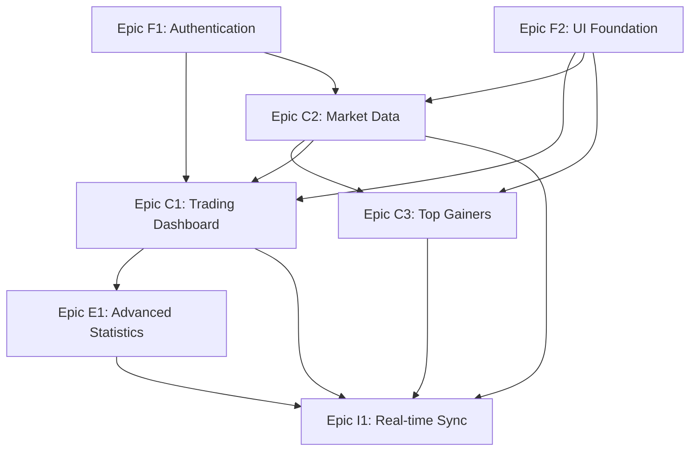

name: "Trading Dashboard - Project Epic Breakdown"
description: |
Epic decomposition for a React Trading Dashboard application with real-time data,
statistics tracking, and secure authentication. Optimized for parallel development
using shadcn/ui components and Supabase backend with free API integration.

---

## Project Goal & Vision

**Project Name**: Trading Dashboard

**Vision Statement**: A comprehensive React-based trading dashboard that provides real-time market data, trade management, statistical analysis, and secure user authentication for active traders.

**Strategic Objectives**:

- Enable traders to monitor active positions and market conditions in real-time
- Provide comprehensive trading statistics and performance analytics
- Deliver industry-standard security for sensitive financial data
- Create an intuitive, responsive interface using modern UI components

**Target Timeline**: 8-12 weeks for full implementation

**Team Structure**: 3-4 developers working on parallel Epics, with potential for AI agent assistance

## Project Scope Definition

### Core Business Capabilities

**Primary User Journeys**:

1. **Trader Authentication**: User → Secure Login → Dashboard Access → Protected Trading Data
2. **Trading Monitoring**: User → Home Dashboard → View Active Trades → Monitor P&L and Risk Metrics
3. **Market Analysis**: User → Market Widgets → Check Trading Conditions → View Top Gainers
4. **Performance Analytics**: User → Statistics Page → Review Historical Performance → Analyze Trading Patterns

**Key Business Rules**:

- **Risk Management**: All trades must display risk:reward ratios and stop/target levels
- **Market Data Accuracy**: Real-time price data with appropriate fallback for API limitations
- **Data Security**: All user authentication and trading data must be encrypted and secure
- **Performance Tracking**: Complete audit trail of all trades with statistical analysis

**Success Criteria**:

- [ ] **User Authentication**: Secure login/logout with session management
- [ ] **Real-time Dashboard**: Live market data and trade monitoring with <2s latency
- [ ] **Statistical Analysis**: Complete trading performance metrics and visualizations
- [ ] **Responsive Design**: Mobile-friendly interface using shadcn/ui components
- [ ] **Data Persistence**: Reliable data storage and retrieval via Supabase

### Technology & Architecture Context

**Technology Stack**:

```yaml
# Core Technology Decisions
frontend: React 18+ with TypeScript
ui_framework: shadcn/ui with Tailwind CSS
state_management: React Query + Zustand
routing: React Router v6
charts: shadcn/ui charts (built on Recharts)
backend: Supabase (Auth + Database + Real-time)
database: PostgreSQL (via Supabase)
api_integration: Free financial APIs (Alpha Vantage, Polygon free tier)
deployment: Vercel or Netlify
```

**Architectural Patterns**:

- **Architecture Style**: Frontend-focused SPA with Supabase backend-as-a-service
- **Data Strategy**: Real-time subscriptions with cached market data
- **Integration Pattern**: RESTful APIs with WebSocket connections for live data
- **Security Model**: Supabase Row Level Security (RLS) with JWT authentication
- **Chart Strategy**: shadcn/ui charts for consistent design system integration

**Technical Constraints**:

- **Free API Limits**: Use free tier APIs with appropriate caching and rate limiting
- **Real-time Requirements**: Market data updates every 15-60 seconds (free tier limitations)
- **Security Compliance**: Industry-standard authentication and data protection
- **Performance**: Sub-3 second page loads and responsive UI interactions

## Epic Decomposition Strategy

### Independence Criteria

**For each Epic to be truly independent, it must have:**

- [x] **Data Independence**: Own database tables and data models
- [x] **API Boundaries**: Clear interfaces between frontend components and data services
- [x] **Deployment Independence**: Individual features can be deployed separately
- [x] **Team Independence**: Different developers can work on separate Epics
- [x] **Testing Independence**: Each Epic can be tested with mocked dependencies

### Epic Priority Framework

**Priority Levels**:

1. **Foundation Epics**: Authentication, database setup, UI foundation (Must be first)
2. **Core Epics**: Trading dashboard, market data integration (High business value)
3. **Enhancement Epics**: Advanced statistics, performance analytics (Value-add features)
4. **Integration Epics**: Cross-feature workflows and optimizations

## Project Epic Breakdown

### Foundation Layer Epics

#### Epic F1: Authentication & Security Foundation

**Epic Purpose**: Secure user authentication system with industry-standard login/logout functionality

**Business Value**: Enables secure access to sensitive trading data and establishes user session management

**Key Capabilities**:

- Secure user registration and login with email/password
- JWT-based session management with automatic token refresh
- Password recovery and account management
- Row-level security for data access control

**Epic Dependencies**:

- **Upstream**: Supabase project setup and configuration
- **Downstream**: All other Epics require authentication for data access

**Data Models**:

```yaml
# Authentication entities managed by this Epic
entities:
  - users: { id, email, password_hash, created_at, updated_at, profile_data }
  - user_sessions: { id, user_id, token, expires_at, created_at }
```

**API Surface**:

```yaml
# Authentication APIs provided by this Epic
apis:
  - AuthService: { login, logout, register, refreshToken, resetPassword }
  - UserProfile: { getProfile, updateProfile, deleteAccount }
```

**Epic Success Criteria**:

- [ ] Users can register with email/password validation
- [ ] Secure login/logout with JWT token management
- [ ] Password recovery flow operational
- [ ] Protected routes enforce authentication
- [ ] Supabase RLS policies configured correctly

**Estimated Epic Complexity**: Medium (M)

**Parallelization Potential**: Low - Foundation Epic that others depend on

---

#### Epic F2: UI Foundation & Component Library

**Epic Purpose**: Establish design system and reusable UI components using shadcn/ui

**Business Value**: Provides consistent, accessible, and responsive UI foundation for all features

**Key Capabilities**:

- Complete shadcn/ui setup with custom theme configuration
- Reusable dashboard layout components (header, sidebar, content areas)
- Data table components for displaying trading information
- Chart containers and visualization components
- Responsive navigation and mobile-friendly layouts

**Epic Dependencies**:

- **Upstream**: React project initialization and Tailwind CSS setup
- **Downstream**: All UI-dependent Epics use these components

**Data Models**:

```yaml
# UI configuration entities
entities:
  - theme_preferences: { user_id, theme, layout_settings, widget_preferences }
  - ui_state: { sidebar_collapsed, active_tab, filter_preferences }
```

**API Surface**:

```yaml
# UI foundation services
apis:
  - ThemeService: { getTheme, setTheme, getLayoutPreferences }
  - UIStateService: { saveUIState, restoreUIState, resetToDefaults }
```

**Epic Success Criteria**:

- [ ] Complete shadcn/ui integration with custom Trading Dashboard theme
- [ ] Responsive layout components working across all screen sizes
- [ ] Reusable data table component with sorting/filtering
- [ ] Chart container components ready for data integration
- [ ] Consistent styling and accessibility compliance

**Estimated Epic Complexity**: Medium (M)

**Parallelization Potential**: Medium - Can work on different component types simultaneously

---

### Core Business Epics

#### Epic C1: Trading Dashboard & Position Management

**Epic Purpose**: Core trading dashboard displaying active trades, watchlists, and real-time position monitoring

**Business Value**: Primary value delivery - enables traders to monitor their active positions and make informed decisions

**Key Capabilities**:

- Real-time display of active trades with P&L calculations
- Today's watchlist with current market prices
- Trade management interface (view entry, stop, target levels)
- Risk:reward ratio calculations and profit/loss tracking
- Closed trades summary for daily performance review

**Epic Dependencies**:

- **Upstream**: Epic F1 (Authentication), Epic F2 (UI Foundation)
- **Downstream**: Epic E1 (Advanced Statistics) uses this trade data

**User Personas Served**:

- **Active Traders**: Primary users monitoring daily positions and performance
- **Risk Managers**: Users focused on stop-loss and risk management metrics

**Data Models**:

```yaml
# Trading entities managed by this Epic
entities:
  - trades:
      {
        id,
        user_id,
        instrument,
        ticker,
        entry_price,
        stop_loss,
        target_price,
        quantity,
        status,
        entry_date,
        exit_date,
        exit_price,
        profit_loss,
      }
  - watchlists:
      {
        id,
        user_id,
        instrument,
        ticker,
        current_price,
        price_change,
        last_updated,
      }
  - daily_summaries:
      { id, user_id, date, total_pnl, active_trades_count, closed_trades_count }
```

**API Surface**:

```yaml
# Trading APIs provided by this Epic
apis:
  - TradeService:
      { getActiveTrades, getClosedTrades, addTrade, updateTrade, closeTrade }
  - WatchlistService:
      { getWatchlist, addToWatchlist, removeFromWatchlist, updatePrices }
  - PositionService: { calculatePnL, getRiskReward, getPositionSummary }
```

**Epic Success Criteria**:

- [ ] Active trades displayed with real-time P&L calculations
- [ ] Watchlist shows current prices with percentage changes
- [ ] Risk:reward ratios calculated and displayed correctly
- [ ] Closed trades summary shows daily performance
- [ ] Data tables support sorting and filtering

**Estimated Epic Complexity**: Large (L)

**Parallelization Potential**: High - Can split into active trades, watchlist, and closed trades components

---

#### Epic C2: Market Data Integration & Trading Signals

**Epic Purpose**: Integration with free market data APIs and trading signal generation

**Business Value**: Provides real-time market context and trading condition indicators to support decision-making

**Key Capabilities**:

- Integration with free market data APIs (Alpha Vantage, Polygon free tier)
- Real-time price updates for watchlist instruments
- Trading condition widget (NQ1! EMA analysis)
- Market status indicators (open/closed) for different exchanges
- Rate limiting and caching for API efficiency

**Epic Dependencies**:

- **Upstream**: Epic F2 (UI Foundation) for display components
- **Downstream**: Epic C1 uses market data for position valuations

**Data Models**:

```yaml
# Market data entities
entities:
  - market_data:
      { symbol, price, change, change_percent, volume, last_updated, source }
  - trading_signals:
      {
        symbol,
        signal_type,
        condition_met,
        ema10,
        ema20,
        trend_direction,
        timestamp,
      }
  - api_usage: { provider, endpoint, calls_count, reset_time, daily_limit }
```

**API Surface**:

```yaml
# Market data APIs
apis:
  - MarketDataService: { getCurrentPrice, getBatchPrices, getMarketStatus }
  - SignalService: { getTradingSignal, checkEMACondition, getMarketTrend }
  - CacheService: { getCachedPrice, updateCache, validateCacheAge }
```

**Epic Success Criteria**:

- [ ] Real-time price updates for all watchlist items
- [ ] Trading signal widget shows NQ1! EMA analysis
- [ ] Market status correctly displays open/closed states
- [ ] API rate limits respected with appropriate caching
- [ ] Fallback mechanisms for API failures

**Estimated Epic Complexity**: Large (L)

**Parallelization Potential**: Medium - Can split between price feeds and signal generation

---

#### Epic C3: Top Gainers & Market Analytics

**Epic Purpose**: Display market analytics including top gainers for different time periods and market cap categories

**Business Value**: Provides market context and opportunity identification for traders

**Key Capabilities**:

- Top 10 gainers for small, mid, and large cap stocks
- Multiple time period analysis (30, 60, 120 days)
- Industry group categorization for gainers
- Percentage gain calculations and ranking
- Market sentiment indicators

**Epic Dependencies**:

- **Upstream**: Epic C2 (Market Data Integration) for data sources
- **Downstream**: Can be enhanced by Epic E1 for correlation analysis

**Data Models**:

```yaml
# Market analytics entities
entities:
  - top_gainers:
      {
        symbol,
        company_name,
        market_cap_category,
        percentage_gain,
        period_days,
        industry_group,
        rank,
        last_updated,
      }
  - market_analytics:
      {
        date,
        market_cap_category,
        top_performer,
        average_gain,
        sector_performance,
      }
```

**API Surface**:

```yaml
# Analytics APIs
apis:
  - GainersService: { getTopGainers, getGainersByCategory, getGainersByPeriod }
  - AnalyticsService: { getMarketSummary, getSectorPerformance, getRankings }
```

**Epic Success Criteria**:

- [ ] Top 10 gainers displayed for each market cap category
- [ ] Multiple time period filters working correctly
- [ ] Industry group information shown for each gainer
- [ ] Data refreshed automatically with appropriate frequency
- [ ] Performance ranking algorithms working accurately

**Estimated Epic Complexity**: Medium (M)

**Parallelization Potential**: High - Can split between different market cap categories and time periods

---

### Enhancement Layer Epics

#### Epic E1: Advanced Trading Statistics & Analytics

**Epic Purpose**: Comprehensive trading performance analysis with statistical visualizations and metrics

**Business Value**: Enables traders to analyze performance patterns and improve trading strategies

**Key Capabilities**:

- Interactive equity curve chart showing account growth over time
- Return distribution analysis with bell curve visualization
- Comprehensive trading statistics (win rate, average R:R, time in market)
- Historical trades data table with filtering and export capabilities
- Performance comparison across different time periods

**Epic Dependencies**:

- **Upstream**: Epic C1 (Trading Dashboard) for historical trade data
- **Downstream**: Future reporting and export features

**Data Models**:

```yaml
# Analytics entities
entities:
  - trading_statistics:
      {
        user_id,
        period_start,
        period_end,
        total_trades,
        win_rate,
        avg_risk_reward,
        avg_profit,
        avg_time_winners,
        avg_time_losers,
      }
  - equity_curve:
      { user_id, date, portfolio_value, daily_pnl, cumulative_pnl, trade_count }
  - return_distribution:
      { user_id, return_bucket, frequency, percentage_of_total }
```

**API Surface**:

```yaml
# Statistics APIs
apis:
  - StatisticsService:
      { calculateTradingStats, getEquityCurve, getReturnDistribution }
  - AnalyticsService: { getPerformanceMetrics, generateReports, exportData }
```

**Epic Success Criteria**:

- [ ] Equity curve chart displays account growth accurately
- [ ] Bell curve shows return distribution correctly
- [ ] All trading statistics calculated and displayed
- [ ] Historical trades table with advanced filtering
- [ ] Export functionality for data analysis

**Estimated Epic Complexity**: Large (L)

**Parallelization Potential**: High - Can split between different chart types and statistics calculations

---

### Integration Layer Epics

#### Epic I1: Real-time Data Synchronization & Performance Optimization

**Epic Purpose**: Optimize real-time data flow, implement caching strategies, and ensure performance across all features

**Business Value**: Ensures smooth user experience with fast loading times and reliable data updates

**Key Capabilities**:

- Real-time WebSocket connections for live price updates
- Intelligent caching strategies for market data
- Performance monitoring and optimization
- Error handling and retry mechanisms for API failures
- Data synchronization between different dashboard components

**Epic Dependencies**:

- **Upstream**: All Core Epics must provide stable APIs
- **Downstream**: Enhanced monitoring and alerting capabilities

**Integration Patterns**:

```yaml
# Integration patterns and orchestration
patterns:
  - WebSocketManager: Real-time price update distribution to all components
  - CacheStrategy: Multi-level caching for API responses and calculations
  - ErrorBoundary: Graceful error handling and recovery mechanisms
```

**API Surface**:

```yaml
# Integration APIs
apis:
  - RealtimeService: { subscribeToUpdates, unsubscribe, broadcastUpdate }
  - CacheManager: { get, set, invalidate, bulkUpdate }
  - PerformanceMonitor: { trackLoadTimes, logErrors, generateMetrics }
```

**Epic Success Criteria**:

- [ ] Real-time updates working across all dashboard components
- [ ] Page load times under 3 seconds
- [ ] Graceful handling of API failures and network issues
- [ ] Memory usage optimized for long-running sessions
- [ ] Error monitoring and alerting system operational

**Estimated Epic Complexity**: Medium (M)

**Parallelization Potential**: Low - Requires coordination across all other Epics

---

## Epic Dependency Matrix

### Dependency Visualization



### Parallel Development Phases

**Phase 1 - Foundation (Weeks 1-3)**:

- Epic F1: Authentication & Security - Team Alpha
- Epic F2: UI Foundation & Components - Team Beta

**Phase 2 - Core Development (Weeks 2-8)** _(Can start as Foundation APIs stabilize)_:

- Epic C1: Trading Dashboard - Team Alpha + 1 developer
- Epic C2: Market Data Integration - Team Beta + 1 developer
- Epic C3: Top Gainers Analytics - Team Gamma (or AI agent)

**Phase 3 - Enhancement & Integration (Weeks 6-12)** _(Can start as Core Epics near completion)_:

- Epic E1: Advanced Statistics - Available developers
- Epic I1: Real-time Synchronization - Integration specialists

## Epic Feature Breakdown Process

### From Epic to Features (Using prp_planning.md)

For each Epic identified above, use the following process to break down into implementable features:

1. **Take Epic scope and capabilities**
2. **Run prp_planning.md template** with Epic context:
   ```
   /planning-create Epic [Epic-Name]: [Epic Purpose and Key Capabilities]
   ```
3. **Generate Epic-specific feature breakdown**
4. **Validate feature independence within Epic boundaries**
5. **Create implementation roadmap for Epic**

### Feature-Level PRP Generation

Once features are identified from Epic breakdown:

1. **For each feature**, create detailed PRP:
   ```
   /create-base-prp [Feature Description] with Epic [Epic-Name] context
   ```
2. **Ensure feature PRPs include**:
   - Epic context and API boundaries
   - Supabase integration patterns
   - shadcn/ui component specifications
   - Free API integration best practices

## Project Validation Gates

### Epic Independence Validation

Before proceeding with Epic development:

- [ ] **API Contract Validation**: All Epic APIs are well-defined with TypeScript interfaces
- [ ] **Data Model Validation**: Supabase table schemas and RLS policies designed
- [ ] **Dependency Validation**: Epic dependency graph is clear and manageable
- [ ] **Team Assignment Validation**: Each Epic has dedicated ownership
- [ ] **Integration Point Validation**: Component interfaces and data flow patterns defined

### Project Progress Validation

**Weekly Epic Health Checks**:

```bash
# Validate Epic progress and dependencies
npm run build
npm run test
npm run lint
npm run type-check
```

**Epic Completion Criteria**:

- [ ] All Epic features delivered and tested
- [ ] Component APIs stable and documented
- [ ] Supabase integration points validated
- [ ] Epic success criteria met
- [ ] Code coverage and quality standards met

---

## DEFINITIVE EPIC & FEATURE BREAKDOWN

### Epic List Summary

| Epic ID | Epic Name                                 | Team Assignment  | Complexity | Duration | Dependencies       |
| ------- | ----------------------------------------- | ---------------- | ---------- | -------- | ------------------ |
| **F1**  | Authentication & Security Foundation      | Team Alpha       | M          | 3 weeks  | Supabase setup     |
| **F2**  | UI Foundation & Component Library         | Team Beta        | M          | 3 weeks  | React project init |
| **C1**  | Trading Dashboard & Position Management   | Team Alpha       | L          | 6 weeks  | F1, F2             |
| **C2**  | Market Data Integration & Trading Signals | Team Beta        | L          | 6 weeks  | F2                 |
| **C3**  | Top Gainers & Market Analytics            | Team Gamma       | M          | 4 weeks  | C2                 |
| **E1**  | Advanced Trading Statistics & Analytics   | Available Team   | L          | 6 weeks  | C1                 |
| **I1**  | Real-time Data Sync & Performance         | Integration Team | M          | 4 weeks  | All Core Epics     |

### EPIC F1: Authentication & Security Foundation

**Epic Owner**: Team Alpha (2 developers)  
**Timeline**: Weeks 1-3  
**Implementation Commands**:

```bash
/planning-create "Epic F1: Authentication & Security Foundation - Supabase JWT auth, user management, RLS policies"
/create-base-prp "implement authentication system using PRPs/auth-foundation-prd.md"
```

**Complete Feature List**:

1. **F1.1: User Registration & Login System**

   - Email/password registration with validation
   - Secure login with JWT token generation
   - Password strength requirements and validation
   - Email verification flow for new accounts
   - Login rate limiting and brute force protection

2. **F1.2: Session Management & Token Handling**

   - JWT token refresh mechanism
   - Automatic session timeout handling
   - Secure token storage in httpOnly cookies
   - Session persistence across browser refreshes
   - Multi-device session management

3. **F1.3: Password Recovery & Account Management**

   - Password reset flow with email verification
   - Account email change functionality
   - Profile information update capabilities
   - Account deletion with data cleanup
   - Security audit log for account changes

4. **F1.4: Protected Routes & Authorization**

   - React Router protected route implementation
   - Role-based access control (future-ready)
   - Redirect handling for unauthorized access
   - Loading states during auth verification
   - Error handling for auth failures

5. **F1.5: Supabase RLS Policies & Data Security**
   - Row Level Security policy configuration
   - User data isolation and access control
   - Database security rules implementation
   - API security middleware setup
   - Data encryption for sensitive information

---

### EPIC F2: UI Foundation & Component Library

**Epic Owner**: Team Beta (2 developers)  
**Timeline**: Weeks 1-3  
**Implementation Commands**:

```bash
/planning-create "Epic F2: UI Foundation - shadcn/ui setup, layout components, theme system"
/create-base-prp "implement UI foundation using PRPs/ui-foundation-prd.md"
```

**Complete Feature List**:

1. **F2.1: shadcn/ui Setup & Configuration**

   - Complete shadcn/ui installation and configuration
   - Custom theme creation for Trading Dashboard
   - Tailwind CSS integration and optimization
   - Dark/light mode toggle implementation
   - Color palette and typography system

2. **F2.2: Dashboard Layout Components**

   - Main dashboard layout with header and sidebar
   - Responsive navigation menu with mobile support
   - Content area layout with grid system
   - Breadcrumb navigation implementation
   - Page loading and error boundary components

3. **F2.3: Data Table Components**

   - Reusable data table with sorting and filtering
   - Pagination for large datasets
   - Custom column definitions and formatting
   - Row selection and bulk actions
   - Export functionality for table data

4. **F2.4: Chart & Visualization Components**

   - shadcn/ui chart components setup and configuration
   - Responsive chart sizing and mobile optimization
   - Loading states and error handling for charts
   - Chart legend and tooltip customization using shadcn/ui patterns
   - Interactive chart controls and filters with shadcn/ui components

5. **F2.5: Form & Input Components**

   - Trading-specific form inputs (price, quantity, etc.)
   - Form validation and error messaging
   - Auto-complete components for instrument search
   - Date and time picker components
   - File upload component for trade import

6. **F2.6: Widget & Card Components**
   - Dashboard widget containers
   - Statistics display cards
   - Alert and notification components
   - Progress indicators and status badges
   - Modal and dialog components

---

### EPIC C1: Trading Dashboard & Position Management

**Epic Owner**: Team Alpha (2-3 developers)  
**Timeline**: Weeks 3-8  
**Implementation Commands**:

```bash
/planning-create "Epic C1: Trading Dashboard - active trades, watchlist, P&L tracking, position management"
/create-base-prp "implement trading dashboard using PRPs/trading-dashboard-prd.md"
```

**Complete Feature List**:

1. **C1.1: Active Trades Display & Management**

   - Real-time active trades table with live P&L
   - Trade entry form with validation
   - Position sizing calculator
   - Stop loss and take profit level management
   - Trade notes and tagging system

2. **C1.2: Watchlist Management System**

   - Add/remove instruments to watchlist
   - Real-time price updates for watchlist items
   - Price change indicators (up/down arrows, colors)
   - Watchlist grouping and categorization
   - Bulk watchlist import/export functionality

3. **C1.3: Risk & Reward Calculations**

   - Automatic risk:reward ratio calculations
   - Position risk percentage calculation
   - Portfolio heat (total risk exposure)
   - Profit/loss calculations in $ and R units
   - Risk management alerts and warnings

4. **C1.4: Closed Trades Summary**

   - Daily closed trades summary
   - Closed trade details with exit analysis
   - Quick performance metrics for the day
   - Trade closing workflow and confirmation
   - Historical trade search and filtering

5. **C1.5: Trade Import & Export**

   - CSV import for existing trades
   - Manual trade entry with validation
   - Trade data export for external analysis
   - Bulk trade operations (close multiple, etc.)
   - Trade data backup and restore

6. **C1.6: Position Monitoring Dashboard**
   - Real-time portfolio value display
   - Daily P&L summary widget
   - Open position count and value
   - Market exposure by sector/instrument
   - Risk exposure monitoring

---

### EPIC C2: Market Data Integration & Trading Signals

**Epic Owner**: Team Beta (2 developers)  
**Timeline**: Weeks 3-8  
**Implementation Commands**:

```bash
/planning-create "Epic C2: Market Data Integration - free APIs, real-time prices, trading signals"
/create-base-prp "implement market data integration using PRPs/market-data-prd.md"
```

**Complete Feature List**:

1. **C2.1: Free API Integration Setup**

   - Alpha Vantage API integration with free tier management
   - Polygon.io free tier integration
   - Yahoo Finance API fallback integration
   - API key management and rotation
   - Rate limiting and quota monitoring

2. **C2.2: Real-time Price Data Service**

   - WebSocket connections for live price updates
   - Price data caching with TTL management
   - Batch price fetching optimization
   - Price data validation and error handling
   - Historical price data retrieval

3. **C2.3: Trading Signal Generation**

   - NQ1! EMA 10/20 crossover signal
   - Trend direction analysis and display
   - Market condition indicator widget
   - Signal history and backtesting data
   - Custom signal configuration options

4. **C2.4: Market Status Integration**

   - Real-time market open/close status
   - Exchange holiday calendar integration
   - Pre/post market hours indication
   - Market session time display
   - Multiple market timezone support

5. **C2.5: Data Caching & Performance**

   - Multi-level caching strategy implementation
   - Cache invalidation and refresh logic
   - Offline mode with cached data
   - Background data refresh scheduling
   - API performance monitoring and optimization

6. **C2.6: Error Handling & Fallbacks**
   - API failure detection and automatic failover
   - Graceful degradation when APIs are down
   - User notification for data issues
   - Manual data refresh capabilities
   - Data source reliability monitoring

---

### EPIC C3: Top Gainers & Market Analytics

**Epic Owner**: Team Gamma (1-2 developers)  
**Timeline**: Weeks 5-8  
**Implementation Commands**:

```bash
/planning-create "Epic C3: Top Gainers Analytics - market cap categories, time periods, industry analysis"
/create-base-prp "implement top gainers analytics using PRPs/top-gainers-prd.md"
```

**Complete Feature List**:

1. **C3.1: Top Gainers Data Collection**

   - Small cap top gainers identification
   - Mid cap top gainers tracking
   - Large cap top gainers analysis
   - Percentage gain calculations with time periods
   - Market cap categorization logic

2. **C3.2: Time Period Analysis**

   - 30-day top gainers analysis
   - 60-day top gainers tracking
   - 120-day top gainers identification
   - Period-over-period comparison
   - Historical gainer trend analysis

3. **C3.3: Industry Group Classification**

   - Automatic industry group assignment
   - Sector performance analysis
   - Industry concentration metrics
   - Cross-sector gainer comparison
   - Industry rotation indicators

4. **C3.4: Gainers Display Interface**

   - Interactive top gainers table
   - Market cap category filters
   - Time period selection controls
   - Sorting and ranking functionality
   - Gainer detail drill-down views

5. **C3.5: Market Analytics Dashboard**
   - Market sentiment indicators
   - Sector rotation analysis
   - Volatility metrics display
   - Market breadth indicators
   - Economic calendar integration

---

### EPIC E1: Advanced Trading Statistics & Analytics

**Epic Owner**: Available Team (2-3 developers)  
**Timeline**: Weeks 6-12  
**Implementation Commands**:

```bash
/planning-create "Epic E1: Advanced Statistics - equity curve, distribution analysis, performance metrics"
/create-base-prp "implement advanced statistics using PRPs/advanced-stats-prd.md"
```

**Complete Feature List**:

1. **E1.1: Equity Curve Visualization**

   - Interactive equity curve chart using shadcn/ui charts with zoom/pan
   - Drawdown visualization and analysis with shadcn/ui styling
   - Benchmark comparison (S&P 500, etc.) using multiple chart series
   - Time period selection for curve display with shadcn/ui date pickers
   - Equity curve export and sharing functionality

2. **E1.2: Return Distribution Analysis**

   - Bell curve visualization of returns using shadcn/ui charts
   - Statistical distribution metrics with shadcn/ui card layouts
   - Outlier identification and analysis with interactive tooltips
   - Risk-adjusted return calculations displayed in shadcn/ui format
   - Distribution comparison across time periods with chart overlays

3. **E1.3: Comprehensive Trading Statistics**

   - Win rate calculation and trending
   - Average risk:reward ratio analysis
   - Average profit/loss in $ and R units
   - Time in market analysis for winners/losers
   - Consecutive win/loss streak tracking

4. **E1.4: Historical Trades Analysis**

   - Complete historical trades table
   - Advanced filtering by multiple criteria
   - Trade performance attribution analysis
   - Best/worst trades identification
   - Trade correlation and pattern analysis

5. **E1.5: Performance Attribution & Metrics**

   - Sharpe ratio and risk-adjusted metrics
   - Maximum drawdown analysis
   - Profit factor calculations
   - Expectancy and opportunity metrics
   - Monthly/yearly performance breakdown

6. **E1.6: Reporting & Export Features**
   - PDF report generation
   - Excel export with formatted data
   - Custom date range analysis
   - Performance summary reports
   - Automated monthly/quarterly reports

---

### EPIC I1: Real-time Data Synchronization & Performance Optimization

**Epic Owner**: Integration Team (1-2 developers)  
**Timeline**: Weeks 8-12  
**Implementation Commands**:

```bash
/planning-create "Epic I1: Real-time Sync - WebSocket optimization, caching strategy, performance monitoring"
/create-base-prp "implement real-time synchronization using PRPs/realtime-sync-prd.md"
```

**Complete Feature List**:

1. **I1.1: WebSocket Connection Management**

   - Persistent WebSocket connections for real-time data
   - Automatic reconnection with exponential backoff
   - Connection health monitoring and diagnostics
   - Multiple data stream management
   - Connection pooling for different data types

2. **I1.2: Real-time Data Broadcasting**

   - Live price update distribution to all components
   - Trade status change notifications
   - Portfolio value real-time updates
   - Market event broadcasting
   - User activity synchronization

3. **I1.3: Intelligent Caching Strategy**

   - Multi-level cache implementation (memory, localStorage, server)
   - Cache invalidation strategies for different data types
   - Predictive caching for frequently accessed data
   - Cache warming for critical user data
   - Cache analytics and optimization

4. **I1.4: Performance Monitoring & Optimization**

   - Real-time performance metrics collection
   - Page load time tracking and optimization
   - Memory usage monitoring and cleanup
   - Component render performance analysis
   - API response time monitoring

5. **I1.5: Error Handling & Recovery**

   - Graceful degradation for failed services
   - Automatic retry mechanisms with circuit breakers
   - User-friendly error messaging
   - Background error recovery processes
   - System health status indicators

6. **I1.6: Data Synchronization Coordination**
   - Cross-component data consistency
   - Optimistic updates with conflict resolution
   - Batch update processing for efficiency
   - Data versioning and conflict detection
   - State synchronization across browser tabs

---

## Implementation Roadmap

### Phase 1: Foundation Setup (Weeks 1-3)

```bash
# Start simultaneously
/planning-create "Epic F1: Authentication & Security Foundation"
/planning-create "Epic F2: UI Foundation & Component Library"

# Team Alpha implements Authentication
/create-base-prp "implement authentication system using PRPs/auth-foundation-prd.md"
/execute-base-prp PRPs/auth-foundation-implementation.md

# Team Beta implements UI Foundation
/create-base-prp "implement UI foundation using PRPs/ui-foundation-prd.md"
/execute-base-prp PRPs/ui-foundation-implementation.md
```

### Phase 2: Core Dashboard Development (Weeks 3-8)

```bash
# Team Alpha implements Trading Dashboard (requires F1, F2)
/planning-create "Epic C1: Trading Dashboard & Position Management"
/create-base-prp "implement trading dashboard using PRPs/trading-dashboard-prd.md"
/execute-base-prp PRPs/trading-dashboard-implementation.md

# Team Beta implements Market Data (requires F2)
/planning-create "Epic C2: Market Data Integration & Trading Signals"
/create-base-prp "implement market data integration using PRPs/market-data-prd.md"
/execute-base-prp PRPs/market-data-implementation.md

# Team Gamma implements Top Gainers (requires C2)
/planning-create "Epic C3: Top Gainers & Market Analytics"
/create-base-prp "implement top gainers analytics using PRPs/top-gainers-prd.md"
/execute-base-prp PRPs/top-gainers-implementation.md
```

### Phase 3: Enhancement & Integration (Weeks 6-12)

```bash
# Available team implements Advanced Statistics (requires C1)
/planning-create "Epic E1: Advanced Trading Statistics & Analytics"
/create-base-prp "implement advanced statistics using PRPs/advanced-stats-prd.md"
/execute-base-prp PRPs/advanced-stats-implementation.md

# Integration team implements Real-time Sync (requires all Core Epics)
/planning-create "Epic I1: Real-time Data Synchronization & Performance"
/create-base-prp "implement real-time synchronization using PRPs/realtime-sync-prd.md"
/execute-base-prp PRPs/realtime-sync-implementation.md
```

---

**This definitive breakdown provides 7 Epics with 32 specific features that can be implemented using the standard PRP workflow. Each Epic has clear ownership, dependencies, and implementation commands for immediate execution.**

## Next Steps

1. **Epic Prioritization**: Review Epic breakdown and confirm development sequence

2. **Team Assignment**: Assign Epic ownership to development teams

3. **Supabase Setup**: Initialize Supabase project with database schema

4. **Epic Planning**: For each Epic, run detailed feature breakdown using:

   ```
   /planning-create Epic [Epic-Name]: [Epic scope and capabilities]
   ```

5. **Feature Development**: For each feature within Epics, create detailed PRPs using:

   ```
   /create-base-prp [Feature description] within Epic [Epic-Name]
   ```

6. **Integration Testing**: Establish cross-Epic integration validation processes

---

**Remember**: This Epic breakdown enables maximum parallelization while maintaining architectural coherence. Each Epic provides independent business value while contributing to the complete Trading Dashboard vision.
